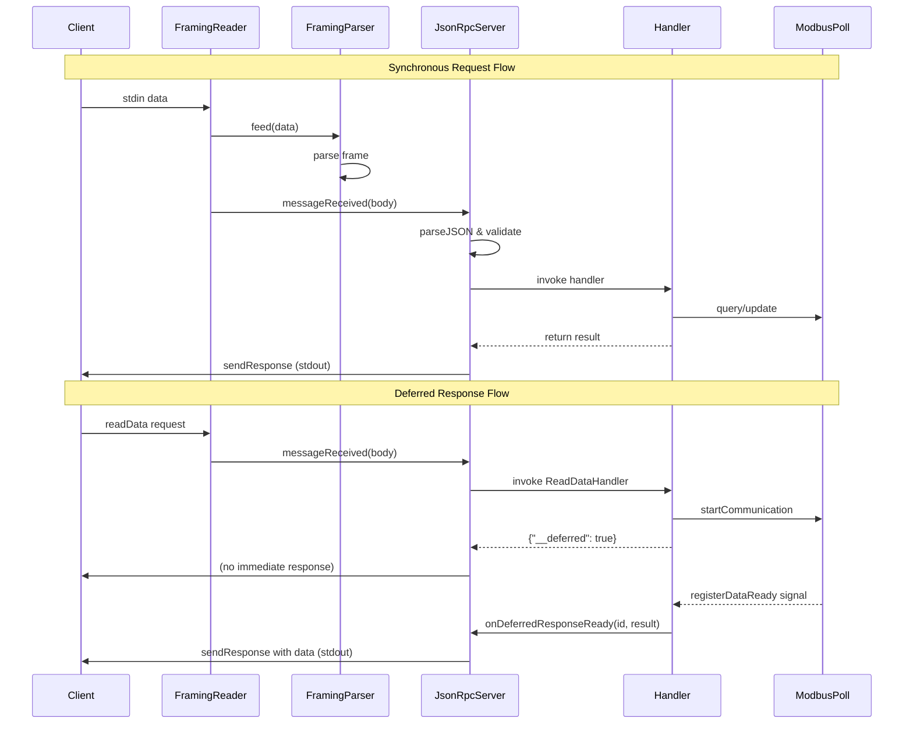

# Sequence diagram

```mermaid
sequenceDiagram
    participant Client
    participant Reader as FramingReader
    participant Parser as FramingParser
    participant Server as JsonRpcServer
    participant Handler
    participant ModbusPoll

    Note over Client,ModbusPoll: Synchronous Request Flow
    Client->>Reader: stdin data
    Reader->>Parser: feed(data)
    Parser->>Parser: parse frame
    Reader->>Server: messageReceived(body)
    Server->>Server: parseJSON & validate
    Server->>Handler: invoke handler
    Handler->>ModbusPoll: query/update
    Handler-->>Server: return result
    Server->>Client: sendResponse (stdout)

    Note over Client,ModbusPoll: Deferred Response Flow
    Client->>Reader: readData request
    Reader->>Server: messageReceived(body)
    Server->>Handler: invoke ReadDataHandler
    Handler->>ModbusPoll: startCommunication
    Handler-->>Server: {"__deferred": true}
    Server->>Client: (no immediate response)
    ModbusPoll-->>Handler: registerDataReady signal
    Handler->>Server: onDeferredResponseReady(id, result)
    Server->>Client: sendResponse with data (stdout)

```

