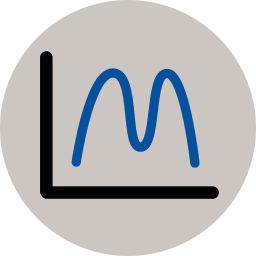
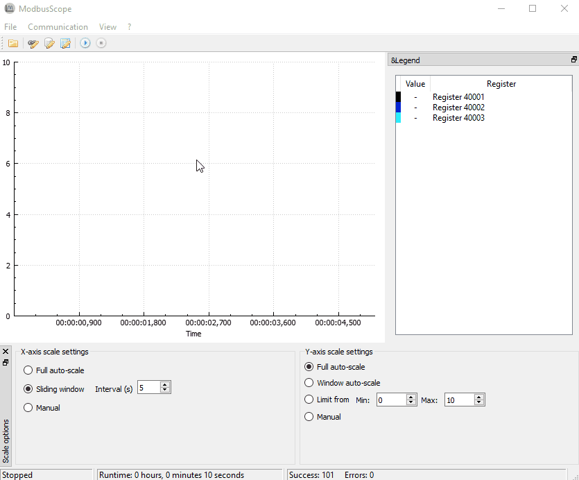

# ModbusScope

Docs: 

Build status: 

Status: 

**ModbusScope is a GUI tool to log data using the [Modbus](https://en.wikipedia.org/wiki/Modbus) protocol into graph.**

## Docs

Docs are available at [https://modbusscope.readthedocs.io](https://modbusscope.readthedocs.io).

## Contributing

Please [open a new issue](https://github.com/jgeudens/ModbusScope/issues) to report bugs or [create a pull request](https://github.com/jgeudens/ModbusScope/pulls) to send patches.
