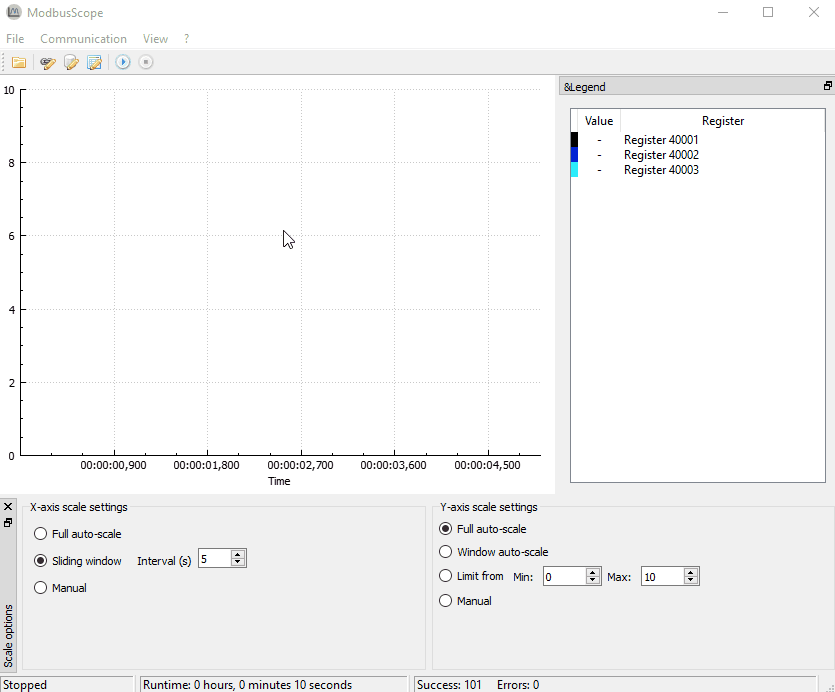

# Build status

# What is ModbusScope
ModbusScope is an application that can be used to log data using the [Modbus](https://en.wikipedia.org/wiki/Modbus) protocol and put the data into a nice graph. It is also possible to export the data or an image of the graph.

# Project 

## Libraries
ModbusScope is written using Qt. The Qt implementation of Modbus is used to communicate with a slave. The other main library that is used is [QCustomPlot](http://www.qcustomplot.com/). This widget provides the possibility to display the data in a new way. 

## Testing
Automated testing is added to the project recently. Both unit testing and integration are being added.

## Cross-platform
ModbusScope aims to be cross platform. Main development is currently done in linux. But the release are done for Windows. Releases are statically linked with the Qt library. This ensures that the ModbusScope runs smoothly on windows without installing any libraries.
