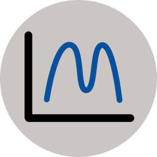
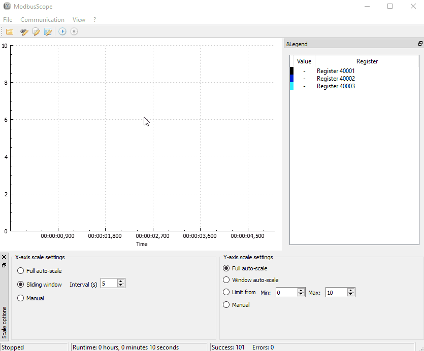

Docs: 

Build status: 

Quality: 

# ModbusScope

ModbusScope is a graphical user interface tool designed for logging and visualizing data using the Modbus protocol. It supports real-time data visualization, enabling users to see graphical representations of data while logging. The tool also allows users to export logged data to CSV files for further analysis. It's highly configurable to suit various data logging needs and supports multiple Modbus devices simultaneously, making it ideal for monitoring devices in industrial automation, energy management, and environmental monitoring.

It started as a personal project and has grown into something people actually rely on. What sets it apart is long-term commitment: the goal is a stable, well-maintained application, not just rapidly shipping features and moving on. ModbusScope is actively maintained and continuously improved.

[**Getting started**](https://modbusscope.readthedocs.io/en/stable/pages/overview.html) | [**Download**](https://github.com/ModbusScope/ModbusScope/releases/latest) | [**Release notes**](https://modbusscope.readthedocs.io/en/stable/pages/release_notes.html)

## Features

- **Real-time Data Visualization**: Provides real-time graphical representations of Modbus data.
  - **Zooming**: Interactively zoom in and out of the graphs to focus on specific time periods or data points.
  - **Markers**: Analyze data (min/max/average/...) within a specific time period.
- **Data Logging**: Continuously logs data from Modbus devices for future analysis.
- **Multiple Device Support**: Capable of handling multiple Modbus devices simultaneously.
- **CSV Export**: Allows export of logged data to CSV files for easy analysis and sharing.
- **Data manipulation**: Perform calculations and combine different multiple registers into one value.

## Documentation

Docs are available at [https://modbusscope.readthedocs.io](https://modbusscope.readthedocs.io).

## Architecture and licensing

The Modbus protocol support is implemented as an external adapter. This adapter is free to use and is bundled with ModbusScope for a smooth out-of-the-box experience. The main application is licensed under the GPL.

Support for additional protocols beyond Modbus is being explored. The intent is to keep existing Modbus functionality free, while having flexibility in how future protocol support is offered.

## Feedback and ideas

Bug reports, feature ideas, and general feedback are very welcome. They directly shape where the project goes.

If you are using ModbusScope, sharing how and where you use it is genuinely helpful. Knowing which features matter most, and which parts of the application feel unclear or harder to use than they should, helps guide ongoing improvements.

The best place for all of this is the [issue tracker](https://github.com/ModbusScope/ModbusScope/issues).

This is a solo-maintained project, so code contributions are not accepted at this time. Bug reports, feature suggestions, and feedback are always welcome and genuinely valuable.

## Support

For support, please visit the [documentation](https://modbusscope.readthedocs.io/en/stable/) or open an issue on the [GitHub page](https://github.com/ModbusScope/ModbusScope/issues).
