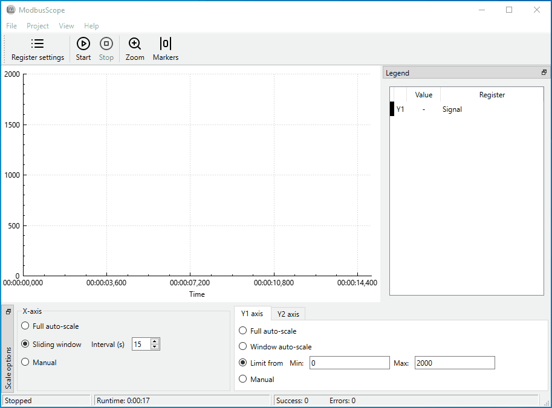

# ModbusScope

ModbusScope is a GUI tool to log data using the [Modbus](https://en.wikipedia.org/wiki/Modbus) protocol and put the data into a graph. Data can be examined while the logging continues. It is also possible to export the data to a csv file for analyzing the data afterwards.

