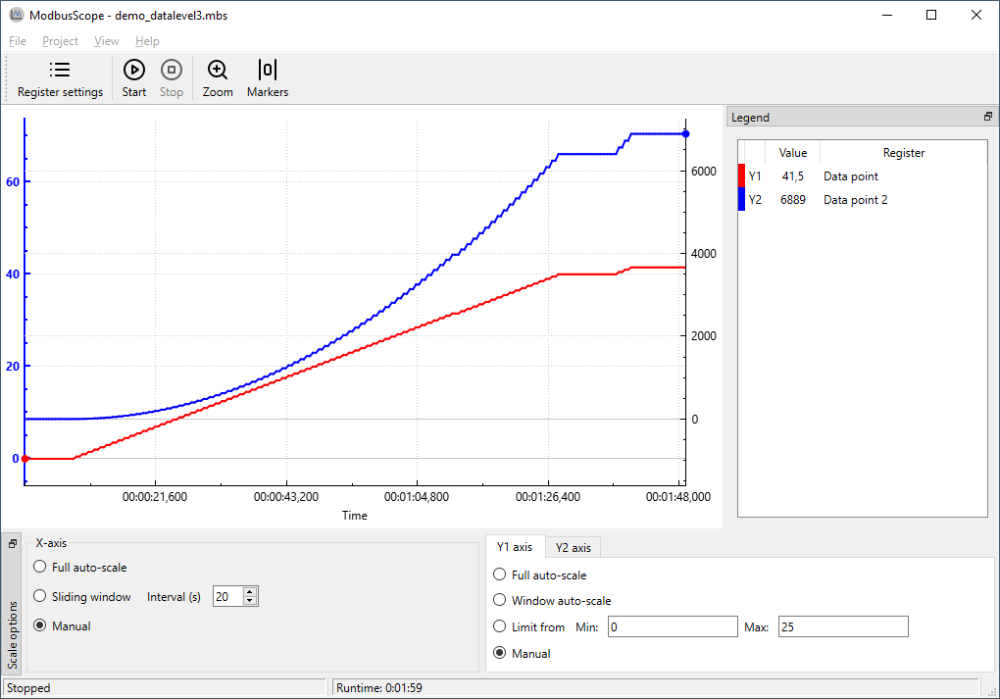

# Introduction

[**Website**](https://modbusscope.github.io/) | [**Download**](https://github.com/ModbusScope/ModbusScope/releases/latest)

ModbusScope is a graphical tool for logging and visualizing Modbus data in real time. It connects to one or more Modbus slaves over TCP or RTU, plots register values as they arrive, and exports data to CSV for further analysis.

## Features

- **Real-time graphing** — plot Modbus register values live over TCP or RTU
- **Zoom and pan** — interactively navigate the graph to inspect any time window
- **Markers** — place two markers on the graph to measure elapsed time and value differences
- **Multiple devices** — log registers from several Modbus slaves simultaneously
- **Expressions** — write formulas to convert units or combine multiple registers into one value
- **CSV export** — save logged data to CSV for further analysis

**New here?** Start with the **Your first logging session** tutorial in the sidebar.
