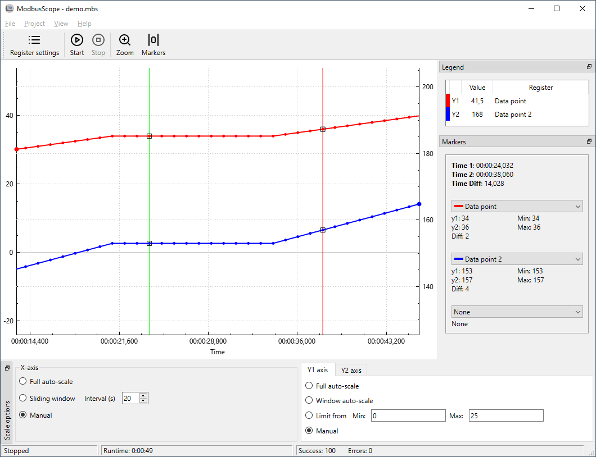

# Graphview

## Start/stop log

Once you have added the desired Modbus registers, you can begin logging data by pressing the *Start Logging* button. ModbusScope will communicate with the Modbus slave specified in the connection settings. The Modbus slave can be connected through a TCP or RTU (serial) connection. Once the *Start Logging* button is pressed, ModbusScope will start logging the data and will automatically display the values on the graph.

> **NOTE**: When you press the *Start Logging* button, it will clear any data that is already present in the graph and start logging new data.

When you have finished testing and collecting data, you can stop logging by pressing the *Stop Logging* button. Once logging is stopped, you can further examine the collected data by using the various windows and tools provided by the application.

## Adjust scale settings

While ModbusScope is logging data, you can view the already logged values in the graph view. The various scale settings allow you to examine the data in different ways and zoom in or out as needed. You can adjust the scale settings to suit your needs and easily examine the data while new values are being added to the log. The software provides several scale settings that you can use to customize the view of the data.

### X-axis

The x-axis of the graph can be scaled in three ways: *full auto-scale*, *sliding window*, and *manual* settings.

* *Full auto-scale* will automatically adjust the maximum of the x-axis to include all time values in the graph.
* *Sliding window* allows you to view only the values of a specific time period, which is configurable.
* *Manual* scale setting means that the scaling is fixed and will not change automatically while logging, even when new values are logged, the current time period stays the same.

### Y1- and Y2-axis

Compared to the x-axis, the y-axis has two similar settings: *full auto-scale* and *manual*. These options work the same way as they do for the x-axis. In addition to these, the y-axis also has two other modes: *window auto-scale* and the *limit from* setting.

* *Window auto-scale* automatically adjusts the range of the y-axis based on the values currently visible in the graph.
* *Limit from* setting allows the user to set the minimum and maximum values for the y-axis.

There are 2 Y-axis available, one for each graph, and the user can select which Y-axis to use per graph. This can be done in the *register* dialog or by double clicking the Y-axis indicator in the legend.

## Zoom graph

The graph-view in *ModbusScope* supports zooming to allow for a more detailed examination of the logged data. By using the scroll wheel on your mouse, both the x- and y-axis can switch to manual setting and the range of the axis will be increased or decreased based on the scroll wheel movement. The current position of the mouse cursor is used as a reference point for the zoom action, allowing you to focus on specific areas of the graph.

*ModbusScope* allows you to select a single axis to zoom in and out of by clicking on it. This means that when you use the mouse wheel, only the selected axis will be zoomed while the range of the other axis will remain the same. To deselect an axis, you can click anywhere in the graph view. Double-clicking an axis will reset it to full auto-scale setting.

The *Zoom* button in *ModbusScope* allows the user to zoom in on a specific region of the graph by drawing a rectangle over the area of interest using the mouse. This makes it easy to focus on a specific section of the data.

## Enable/Disable markers

*ModbusScope* offers a useful feature to investigate dynamic behavior of a system by measuring the time and value differences between two points on the graph. To use this feature, you need to add two vertical markers to the graph. Once the markers are added, you can move them to the desired positions and *ModbusScope* will calculate and display the time and value differences between them. This allows you to easily compare and analyze changes in the system over a specific period of time.

To add the left marker (green vertical line), press the `Ctrl` key and click on the location of interest with the left mouse button. The position must coincide with a sample in the graph. To add the right marker (red vertical line), press the `Ctrl` key and click on the location of interest with the right mouse button.

Once you have added the markers by using the `Ctrl` key and left or right mouse click, a panel called *Markers* will appear on the right side of the screen. This panel displays information about the markers, including the value of the registers at the left marker (Time 1) and the right marker (Time 2). It also shows the time and value difference between the two markers, which allows you to easily compare and analyze the data.

