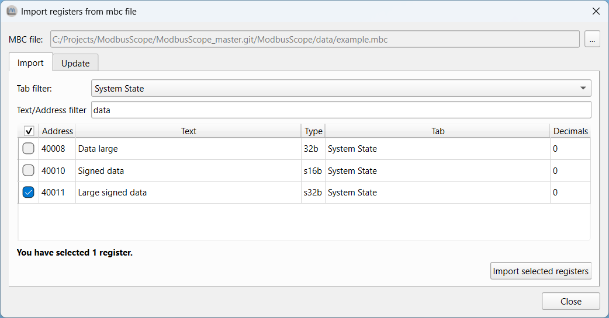

# Importing and exporting

## Saving and opening configuration

The configuration of registers, as described in previous sections, can be saved and loaded in a project file. These settings can be saved in a `.mbs` file by going to *File > Save Project As...* and loaded by going to *File > Open Project...* or by dragging a `.mbs` file into the application.

### Deprecation notice

Starting from *ModbusScope* v4, the format of the `.mbs` project file has changed in an incompatible manner. This was required to support the full 16-bit address range of all object types. Project files saved with *ModbusScope* v3.x.x will be automatically converted on opening.

Support for older project files (pre v3.x.x) has been dropped. It is no longer possible to use these project files in the latest version of *ModbusScope*. A workaround would be to open the project file in ModbusScope v3.x.x and save the project file. The resulting project file will be updated and is compatible with the v4.x.x version.

## Exporting data/image

Current log results can be exported as an image or as data (`.csv`) file. You can select either *File > Save Data File As...* or *File > Export Image As...* to do so. It is important to note that saving a project/data file or exporting an image can only be done when logging is not active.

## Import register definitions from *mbc* file

*ModbusControl* is a proprietary application that isn't available  for the general public. It can be used to read and write data from Modbus slaves. It is possible to import the register definitions from a *ModbusControl* project file (`.mbc`) into *ModbusScope* by clicking on *Import from .mbc file* in the register dialog or by dragging and dropping the `.mbc` file into the main screen of *ModbusScope*. This makes it easy to add register definitions to *ModbusScope* from a *ModbusControl* project file.

