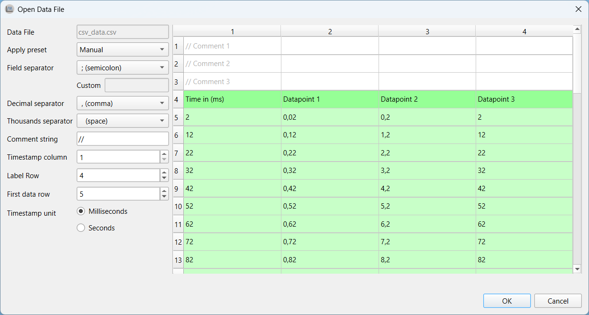

# Open data file

When a data file that was created by *ModbusScope* is opened, the data will be loaded automatically. This can be done by selecting *File* > *Open Data File...* or by dragging the file into the application. If the file format is not compatible with *ModbusScope*, the program will try to automatically determine the necessary settings for parsing the file. This includes the field and decimal separators. These settings can be adjusted manually if needed. Once the settings are configured, the rest of the file will be loaded and the data can be viewed in the graph as with a normal *ModbusScope* log.



## Parse settings

The format of a `.csv` file can vary, so correct settings must be in place for parsing the file. These settings can be adjusted and the results of the parsing will be reflected in the grid display.

### Locale related

Depending on the configured region, the format of the data will be different. To provide maximum flexibility when opening a data file, *ModbusScope* allows to freely select these settings.

* Field separator
  * A symbol used to separate data fields from each other.

* Decimal separator
  * A symbol used to separate the integer part from the fractional part of a number written in decimal form (e.g., "." in 12.45).

* Thousand separator
  * A symbol used to create a division between groups of digits. In this case

### File structure related

*ModbusScope* is able to process and read data from a `.csv` file if it's formatted in a similar way to the files exported by *ModbusScope*. This includes having a column for timestamps and one or more columns for data.

#### Supported data file format

```
Time (ms);Datapoint 1;Datapoint 2;Datapoint 3
2;0,02;0,2;2
12;0,12;1,2;12
22;0,22;2,2;22
32;0,32;3,2;32
```

#### Settings

Since there is no standard for the contents of *.csv* file, some settings needs to filled in to be able to correctly parse time data.

* Comment String
  * Symbol(s) in the beginning of a line that indicate(s) that a line should be ignored when parsing.
  * Shouldn't be longer than 2 characters.

* Time stamp column
  * Sometimes the time data isn't in the first column. This setting can be used to select to correct column.
  * All columns to the right of the time data column will be parsed for data

* Label row
  * This setting indicates the row with the labels (names) for the graphs.
  * Can be used to skip header lines in the file.
  * The label row should contains the same number of fields as the data rows

* Data row
  * Similar to the the label row, but for the data

### Functionality

*ModbusScope* adds some extra functionality when opening a data file. The *time-stamp unit* can be selected between milliseconds and seconds. When seconds is selected, the time-stamp will be converted to milliseconds during the load process.

## Presets

When analyzing several data files of which the settings can't be auto-detected, it is handy to save the settings as a preset. *ModbusScope* allows to create a configuration file with custom presets. This configuration file will be loaded when opening a datafile and the correct preset can be selected. It is also possible to configure a keyword per preset. When a data file name contains the keyword, the preset will be automatically selected.

### Locations

*ModbusScope* searches for the `presets.xml` configuration file in 2 specific locations. The first location is the documents folder of the current Windows user: `C:/Users/<USER>/Documents/`. The preset configuration file should be in a subfolder named `ModbusScope`. When the preset configuration file isn't found, *ModbusScope* will try to find the file in the same location as the main executable of *ModbusScope*. When the file isn't found in both location, *ModbusScope* will use the built-in presets. When a valid preset configuration file has been found, the built-in presets will be replaced will the preset mentioned in this file.

### Keyword

As mentioned before, a preset can be automatically selected based on the presence of a keyword in the name of the data file.

### Example preset configuration file

```xml
<modbusscope>
 <parsepreset>
  <name>Default (be)</name>
  <keyword>-be</keyword>
  <fieldseparator><![CDATA[;]]></fieldseparator>
  <decimalseparator><![CDATA[,]]></decimalseparator>
  <thousandseparator><![CDATA[ ]]></thousandseparator>
  <commentSequence><![CDATA[//]]></commentSequence>
  <column>1</column>
  <labelrow>1</labelrow>
  <datarow>2</datarow>
 </parsepreset>
 
 <parsepreset>
  <name>be-seconds</name>
  <fieldseparator><![CDATA[;]]></fieldseparator>
  <decimalseparator><![CDATA[,]]></decimalseparator>
  <thousandseparator><![CDATA[ ]]></thousandseparator>
  <commentSequence><![CDATA[//]]></commentSequence>
  <column>1</column>
  <labelrow>1</labelrow>
  <datarow>2</datarow>
  <timeinmilliseconds>false</timeinmilliseconds>
 </parsepreset>

</modbusscope>
```
