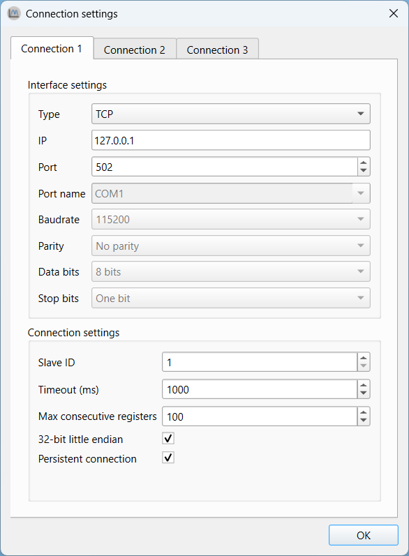
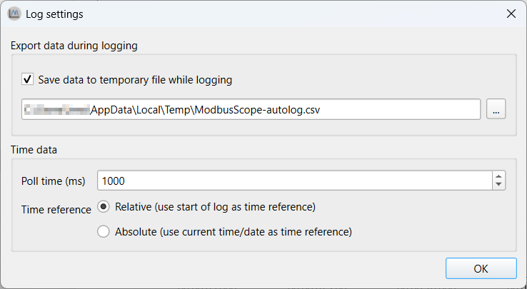
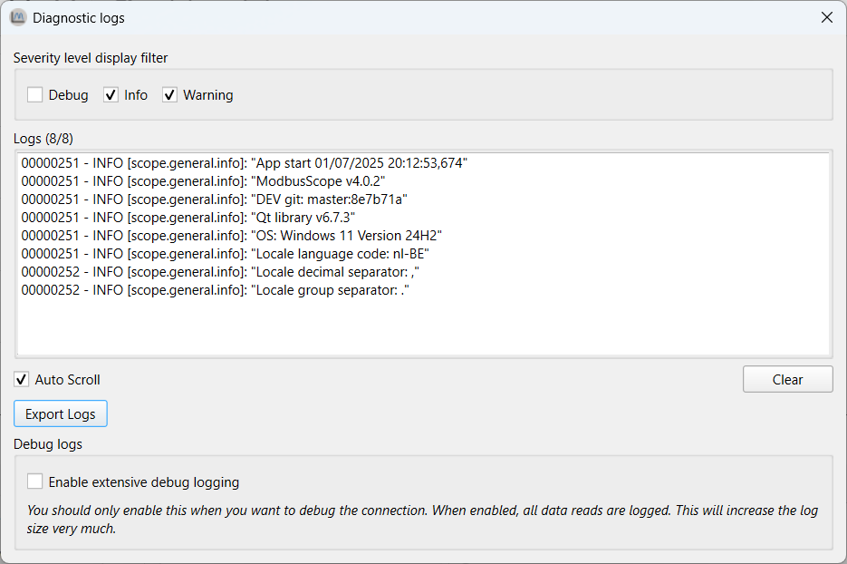
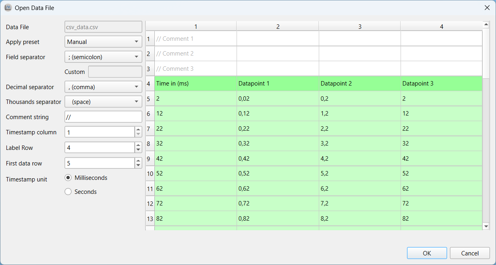

# Overview

## Installing

The *ModbusScope* installer or standalone version can always be downloaded from the [release page](https://github.com/ModbusScope/ModbusScope/releases).

ModbusScope can be easily installed by double-clicking on the provided `.msi` installer file and following the on-screen instructions. The installer will handle the installation of all necessary files on your computer. At the end of the install process, you have the option to set ModbusScope as the default application for opening `.mbs` files.

## Getting started

### Open ModbusScope


### Configuring Modbus Connection

1. Open the configuration settings.
2. Enter the details of your connection to the Modbus device, such as IP address and port.
3. Save the configuration.

### Configure Modbus registers

1. Use the register settings window to add the desired Modbus registers
   1. Change name, colors, type, ...
   2. Optionally perform some calculation on the register.

### Logging Data

1. Click on the "Start Logging" button.
2. Visualize the data in real-time using the provided tools
   1. Adjust the time or value axis scale

### Exporting Data

1. After logging data, click on the "Export" button.
2. Choose the file location and export the data as a CSV file for further analysis.

# Graphview

## Start/stop log

Once you have added the desired Modbus registers, you can begin logging data by pressing the *Start Logging* button. ModbusScope will communicate with the Modbus slave specified in the connection settings. The Modbus slave can be connected through a TCP or RTU (serial) connection. Once the *Start Logging* button is pressed, ModbusScope will start logging the data and will automatically display the values on the graph.

> **NOTE**: When you press the *Start Logging* button, it will clear any data that is already present in the graph and start logging new data.

When you have finished testing and collecting data, you can stop logging by pressing the *Stop Logging* button. Once logging is stopped, you can further examine the collected data by using the various windows and tools provided by the application.

## Adjust scale settings

While ModbusScope is logging data, you can view the already logged values in the graph view. The various scale settings allow you to examine the data in different ways and zoom in or out as needed. You can adjust the scale settings to suit your needs and easily examine the data while new values are being added to the log. The software provides several scale settings that you can use to customize the view of the data.

### X-axis

The x-axis of the graph can be scaled in three ways: *full auto-scale*, *sliding window*, and *manual* settings.

* *Full auto-scale* will automatically adjust the maximum of the x-axis to include all time values in the graph.
* *Sliding window* allows you to view only the values of a specific time period, which is configurable.
* *Manual* scale setting means that the scaling is fixed and will not change automatically while logging, even when new values are logged, the current time period stays the same.

### Y1- and Y2-axis

Compared to the x-axis, the y-axis has two similar settings: *full auto-scale* and *manual*. These options work the same way as they do for the x-axis. In addition to these, the y-axis also has two other modes: *window auto-scale* and the *limit from* setting.

* *Window auto-scale* automatically adjusts the range of the y-axis based on the values currently visible in the graph.
* *Limit from* setting allows the user to set the minimum and maximum values for the y-axis.

There are two Y-axes available, one for each graph, and the user can select which Y-axis to use per graph. This can be done in the *register* dialog or by double-clicking the Y-axis indicator in the legend.

## Zoom graph

The graph-view in *ModbusScope* supports zooming to allow for a more detailed examination of the logged data. By using the scroll wheel on your mouse, both the x- and y-axis can switch to manual setting and the range of the axis will be increased or decreased based on the scroll wheel movement. The current position of the mouse cursor is used as a reference point for the zoom action, allowing you to focus on specific areas of the graph.

*ModbusScope* allows you to select a single axis to zoom in and out of by clicking on it. This means that when you use the mouse wheel, only the selected axis will be zoomed while the range of the other axis will remain the same. To deselect an axis, you can click anywhere in the graph view. Double-clicking an axis will reset it to full auto-scale setting.

The *Zoom* button in *ModbusScope* allows the user to zoom in on a specific region of the graph by drawing a rectangle over the area of interest using the mouse. This makes it easy to focus on a specific section of the data.

## Enable/Disable markers

*ModbusScope* offers a useful feature to investigate dynamic behavior of a system by measuring the time and value differences between two points on the graph. To use this feature, you need to add two vertical markers to the graph. Once the markers are added, you can move them to the desired positions and *ModbusScope* will calculate and display the time and value differences between them. This allows you to easily compare and analyze changes in the system over a specific period of time.

To add the left marker (green vertical line), press the `Ctrl` key and click on the location of interest with the left mouse button. The position must coincide with a sample in the graph. To add the right marker (red vertical line), press the `Ctrl` key and click on the location of interest with the right mouse button.

Once you have added the markers by using the `Ctrl` key and left or right mouse click, a panel called *Markers* will appear on the right side of the screen. This panel displays information about the markers, including the value of the registers at the left marker (Time 1) and the right marker (Time 2). It also shows the time and value difference between the two markers, which allows you to easily compare and analyze the data.


# Configuration

## Configure register settings

When you first open *ModbusScope*, no Modbus registers are added. To add registers, click on *Register Settings* in the tool-bar on the interface. This will open a window where you can add and edit the registers that you want to monitor.

### Add Modbus registers

In the *Register settings* dialog, you can add Modbus registers either manually or by importing them from a *.mbc* file. When you open a *.mbs* file in *ModbusScope*, some registers may already be present in the dialog, which allows you to continue working with the previously used registers.

Once the registers have been added, you can adjust them as needed. This includes updating the name and changing the color. Expressions are used to define which data is added to the graph (and log).

> **NOTE**: The number of registers that are polled can greatly impact the sample rate. To achieve a higher resolution in time, you can either reduce the number of actively polled registers or make sure that the registers are in consecutive addresses so that they can be polled in one packet. This will help to increase the sample rate and improve the resolution of the data.


#### Object types

In *ModbusScope*, a Modbus register is represented as `${REG[@CONN][:TYPE]}` where `REG` is the register address, `CONN` is the connection number, and `TYPE` is the type of the register.

* `${45332}` => 16-bit unsigned using connection 1
* `${45332: s16b}` => 16-bit signed using connection 1
* `${45332@2: 32b}` => 32-bit unsigned using connection 2
* `${45332@2}` => 16-bit unsigned using connection 2

##### Register address

*ModbusScope* supports different function codes of the Modbus standard. It is possible to read coils, discrete inputs, input registers and holding registers. The function code is derived from the register address field in the expression. Two notations are supported in ModbusScope.

The primary notation used in ModbusScope is the old Modicon standard. For example, `${10002}` means reading a discrete input with address 1. This notation has the advantage that two pieces of information are included in a single number: the object type (which function code to use) and the actual address. The maximum range however is limited to address 9999.

The second notation is specific to ModbusScope, but allows to use the full 16-bit address range. The register address field consists of a prefix and a number. The prefix will specify the object type and the number can be the full 16-bit address range.

ModbusScope will use the 5-digit Modicon notation, unless the register address can't be represented because the address is too high, then the prefix notation will be automatically used.

| Modicon 5-digit notation | Full range using prefix | Object type       | Modbus function code |
| ------------------------ | ----------------------- | ----------------- | -------------------- |
| `1` - `9999`             | `c0` - `c65535`         | Coil              | 1                    |
| `10001` - `19999`        | `d0` - `d65535`         | Discrete inputs   | 2                    |
| `30001` - `39999`        | `i0` - `i65535`         | Inputs registers  | 4                    |
| > `40001`                | `h0` - `h65535`         | Holding registers | 3                    |

##### Supported register types

Following types for holding and input registers are currently supported by ModbusScope:

* `16b`: Unsigned 16-bit value

* `s16b`: Signed 16-bit

* `32b`: Unsigned 32-bit value

* `s32b`: Signed 32-bit value

* `f32b`: 32-bit float (IEEE 754)

For coils and discrete inputs, the register type is ignored. The endianness of 32-bit registers can be configured per connection with the `32-bit little-endian` setting in the connection settings dialog. The register type is ignored for coils and discrete inputs.

### Expressions

Expressions are used to define calculations or transformations of data in *ModbusScope*. They can be used to convert raw data from a Modbus register into a more meaningful value, or to perform mathematical operations on multiple registers. These expressions can be defined using a variety of mathematical operators and functions, as well as references to specific registers. For example, you could use an expression to calculate the power usage of a system by multiplying the voltage and current readings from two different registers.

*ModbusScope* supports a variety of binary operators that are commonly used in expressions such as `|` for bitwise OR, `&` for bitwise AND, `<<` for bitwise left shift, and `>>` for bitwise right shift. It also supports basic arithmetic operators like `+`, `-`, `*`, `/`, `%`, and `^` for addition, subtraction, multiplication, division, modulus and exponentiation respectively. In addition to the above operators, *ModbusScope* also supports hexadecimal numbers represented with the `0x` prefix and binary numbers represented with `0b` prefix. It also supports floating-point numbers, and both a decimal point and comma can be used as floating-point separator, whichever is encountered first. This allows for a greater flexibility in creating expressions that suit the user's needs.

Some examples of valid expressions are

* `${40001: s16b} + ${40002@2} * 2`
* `${40001: s32b} * 1.1`
* `${30001} + 0x1000`
* `${40001} & 0b11111000`
* `(${30001} >> 8) & 0xFF`

### Compose expression window

The compose expression window is a feature in *ModbusScope* that allows the user to create custom calculations using registers and other mathematical operations. Expressions allow for more flexibility in defining the data that is logged and displayed on the graph, and it can be used to create expressions that are specific to the user's needs. The compose expression window can be accessed from the register settings dialog, and it provides a user-friendly interface for creating and editing expressions.

This window can be opened by double-clicking the expression cell in the register settings dialog. This allows you to easily test and verify that the expression is functioning correctly before applying it to the logged data. The expression can be updated freely, and the register definition will be validated while you are entering it. When the register definition is green, it means that it is valid. The *example input* table can be used to enter values to test and verify the expression with actual values. This allows you to ensure that the expression is working as intended and to make any necessary adjustments before using it to log data. It is possible to combine multiple register reads in one expression by using mathematical operators and functions.


#### Expression error

When an error is detected in the expression or when the combination of the expression with a specific input value generates an error, no output value will be shown in the *compose expression* window. A specific error message will be displayed to indicate the issue, and the register definition will be highlighted in red, which allows the user to easily identify and correct any errors in the expression. It's important to test the expression before using it to log data, to ensure that it is working correctly and producing the desired results.

## Configure connection settings

The *connection settings* window allows you to configure up to three connections, which means that several Modbus slaves can be polled in a single log session. Each connection can be configured with the specific interface to the slave. ModbusScope supports Modbus TCP and RTU. Modbus ASCII isn't supported.

Some settings such as ip, port, port name, baud rate, parity and number of data and stop bits are specific to the type of connection (TCP or RTU) and are used to establish a connection to the slave device. The other settings such as slave ID, timeout, max consecutive registers, and 32-bit little-endian, are specific to the Modbus protocol implementation in the device and are used to configure how the application communicates with the slave device.

The timeout settings determine how long the application will wait for a response from the slave before timing out. It is possible to read multiple consecutive registers in a single request in Modbus. However, most devices have a limit on the number of consecutive registers that can be read in a single request. This limit is referred to as the *maximum consecutive registers*.

In Modbus, 32-bit values are stored in two consecutive 16-bit registers, in either big-endian or little-endian format. In some devices, 32-bit values are stored in big-endian format by default, while in others they are stored in little-endian format. The 32-bit endianness setting in *ModbusScope* allows you to configure the endianness of the 32-bit values read from the registers, so that the application can correctly interpret the data.

The persistent connection option is specific to *ModbusScope*. When enabled, it allows the application to keep the connection open between polling data points, which can increase the polling rate and reduce the time required to establish new connections. The connection will only be reinitialized when a connection error occurs. It's important to ensure that the connection settings are correct and that the correct protocol is selected before starting a log session. With correct configuration, the application will be able to communicate with the slave device and retrieve data from the registers.

In the *register settings* window, you can link each register to a specific connection. This allows you to poll multiple slaves simultaneously and display the data in a single graph for easy comparison.



### Known limitation

A known limitation of ModbusScope is that a COM port can't be shared between connections. This means that it isn't possible to poll multiple Modbus devices that are connected on the same serial bus.

## Configure log settings

*ModbusScope* creates a data file in the general temporary folder by default when a logging session is started. The data points are appended to the file during the logging session, so that the data can be recovered in case of an unforeseen crash or if the user forgets to save the data before quitting the application. The temporary file is cleared every time a polling session is started, so that new data can be logged. Some of this behavior can be customized in the *log settings* window. The user can choose to disable the feature or change the location of the temporary data file. This allows the user to ensure that the data is saved in a location that is convenient for them.

In the *log settings* window, this behavior can be disabled or the temporary data file can be changed.



By default, *ModbusScope* will log data points every 250 milliseconds. This is the default sample rate and it can be adjusted in the *log settings* window. The user can increase or decrease the sample rate to suit their needs. Additionally, by default, *ModbusScope* will log timestamps relative to the start of the log session. This means that the time-stamp of each data point is recorded as the time elapsed since the start of the logging session. However, this behavior can be changed by enabling the *use absolute times* option in the *log settings* window. When this option is enabled, absolute timestamps are logged instead, meaning that the actual date and time of each data point is recorded in the log file.

This feature allows the user to choose the time-stamp format that is most appropriate for their use case and to easily compare the logged data with other data that may have been collected at different times.

### Optimize logging interval

The minimum logging interval is determined by several factors such as the Modbus protocol and the register addresses. When the requested register addresses aren't in successive order, the Modbus protocol has an inherent slowdown and *ModbusScope* will split the read request into several packets. This will negatively impact the minimum logging interval because of the Modbus end of frame timeout. To achieve a fast logging interval, it's important to limit the number of registers and make sure that consecutive registers are polled. This can help minimize the inherent slowdown caused by the Modbus protocol and allow for a faster logging interval.

# Diagnostics

## Diagnostic logging

During a logging session, various errors may occur. To facilitate quick examination and resolution of these errors, *ModbusScope* has built-in logging capabilities. For example, if a slave responds too slowly, a timeout may be generated. All register reads are recorded in the diagnostic logs along with the results, allowing communication or connection errors to be easily examined. Other common errors include Modbus exceptions, such as when a register configuration is incorrect. The log will also include basic information about *ModbusScope* and the system it is running on, such as the operating system and its specific version.

## Logs window

Opening the *diagnostic logs* windows can be done with *Help > Diagnostic logs...*



The logs can be viewed in the logs window. The log list will dynamically update as new logs are added. By using the filters, specific categories of logs can be hidden or shown. Specific logs can be selected and copied to the clipboard by right-clicking on them. Alternatively, all logs can be exported using the *Export Logs* button. Additionally, extensive debug logging can be enabled to log extra (internal) information about the status of every read. However, this option will dramatically increase the number of logs generated.

# Importing and exporting

## Saving and opening configuration

The configuration of registers, as described in previous sections, can be saved and loaded in a project file. These settings can be saved in a `.mbs` file by going to *File > Save Project As...* and loaded by going to *File > Open Project...* or by dragging a `.mbs` file into the application.

### Deprecation notice

Starting from *ModbusScope* v4, the format of the `.mbs` project file has changed in an incompatible manner. This was required to support the full 16-bit address range of all object types. Project files saved with *ModbusScope* v3.x.x will be automatically converted on opening.

Support for older project files (pre v3.x.x) has been dropped. It is no longer possible to use these project files in the latest version of *ModbusScope*. A workaround would be to open the project file in ModbusScope v3.x.x and save the project file. The resulting project file will be updated and is compatible with the v4.x.x version.

## Exporting data/image

Current log results can be exported as an image or as data (`.csv`) file. You can select either *File > Save Data File As...* or *File > Export Image As...* to do so. It is important to note that saving a project/data file or exporting an image can only be done when logging is not active.

## Import register definitions from *mbc* file

*ModbusControl* is a proprietary application that isn't available for the general public. It can be used to read and write data from Modbus slaves. It is possible to import the register definitions from a *ModbusControl* project file (`.mbc`) into *ModbusScope* by clicking on *Import from .mbc file* in the register dialog or by dragging and dropping the `.mbc` file into the main screen of *ModbusScope*. This makes it easy to add register definitions to *ModbusScope* from a *ModbusControl* project file.


# Open data file

When a data file that was created by *ModbusScope* is opened, the data will be loaded automatically. This can be done by selecting *File* > *Open Data File...* or by dragging the file into the application. If the file format is not compatible with *ModbusScope*, the program will try to automatically determine the necessary settings for parsing the file. This includes the field and decimal separators. These settings can be adjusted manually if needed. Once the settings are configured, the rest of the file will be loaded and the data can be viewed in the graph as with a normal *ModbusScope* log.



## Parse settings

The format of a `.csv` file can vary, so correct settings must be in place for parsing the file. These settings can be adjusted and the results of the parsing will be reflected in the grid display.

### Locale related

Depending on the configured region, the format of the data will be different. To provide maximum flexibility when opening a data file, *ModbusScope* allows to freely select these settings.

* Field separator
  * A symbol used to separate data fields from each other.

* Decimal separator
  * A symbol used to separate the integer part from the fractional part of a number written in decimal form (e.g., "." in 12.45).

* Thousand separator
  * A symbol used to create a division between groups of digits. In this case

### File structure related

*ModbusScope* is able to process and read data from a `.csv` file if it's formatted in a similar way to the files exported by *ModbusScope*. This includes having a column for timestamps and one or more columns for data.

#### Supported data file format

```csv
Time (ms);Datapoint 1;Datapoint 2;Datapoint 3
2;0,02;0,2;2
12;0,12;1,2;12
22;0,22;2,2;22
32;0,32;3,2;32
```

#### Settings

Since there is no standard for the contents of *.csv* file, some settings needs to filled in to be able to correctly parse time data.

* Comment String
  * Symbol(s) in the beginning of a line that indicate(s) that a line should be ignored when parsing.
  * Shouldn't be longer than 2 characters.

* Time stamp column
  * Sometimes the time data isn't in the first column. This setting can be used to select the correct column.
  * All columns to the right of the time data column will be parsed for data

* Label row
  * This setting indicates the row with the labels (names) for the graphs.
  * Can be used to skip header lines in the file.
  * The label row should contain the same number of fields as the data rows

  * Data row
  * Similar to the label row, but for the data

### Functionality

*ModbusScope* adds some extra functionality when opening a data file. The *time-stamp unit* can be selected between milliseconds and seconds. When seconds is selected, the time-stamp will be converted to milliseconds during the load process.

## Presets

When analyzing several data files of which the settings can't be auto-detected, it is handy to save the settings as a preset. *ModbusScope* allows to create a configuration file with custom presets. This configuration file will be loaded when opening a datafile and the correct preset can be selected. It is also possible to configure a keyword per preset. When a data file name contains the keyword, the preset will be automatically selected.

### Locations

*ModbusScope* searches for the `presets.xml` configuration file in 2 specific locations. The first location is the documents folder of the current Windows user: `C:/Users/<USER>/Documents/`. The preset configuration file should be in a subfolder named `ModbusScope`. When the preset configuration file isn't found, *ModbusScope* will try to find the file in the same location as the main executable of *ModbusScope*. When the file isn't found in both location, *ModbusScope* will use the built-in presets. When a valid preset configuration file has been found, the built-in presets will be replaced will the preset mentioned in this file.

### Keyword

As mentioned before, a preset can be automatically selected based on the presence of a keyword in the name of the data file.

### Example preset configuration file

```xml
<modbusscope>
 <parsepreset>
  <name>Default (be)</name>
  <keyword>-be</keyword>
  <fieldseparator><![CDATA[;]]></fieldseparator>
  <decimalseparator><![CDATA[,]]></decimalseparator>
  <thousandseparator><![CDATA[ ]]></thousandseparator>
  <commentSequence><![CDATA[//]]></commentSequence>
  <column>1</column>
  <labelrow>1</labelrow>
  <datarow>2</datarow>
 </parsepreset>
 
 <parsepreset>
  <name>be-seconds</name>
  <fieldseparator><![CDATA[;]]></fieldseparator>
  <decimalseparator><![CDATA[,]]></decimalseparator>
  <thousandseparator><![CDATA[ ]]></thousandseparator>
  <commentSequence><![CDATA[//]]></commentSequence>
  <column>1</column>
  <labelrow>1</labelrow>
  <datarow>2</datarow>
  <timeinmilliseconds>false</timeinmilliseconds>
 </parsepreset>

</modbusscope>
```
