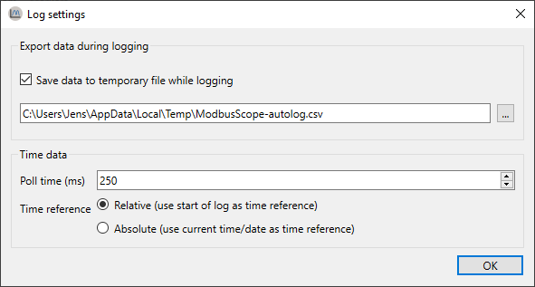

# Configuration

## Configure register settings

When opening *ModbusScope*, no Modbus registers are added. First click on *Register Settings* in the tool bar of  the interface. This will open a window where registers can be added and adjusted.

### Add Modbus registers

In the below dialog Modbus registers can be added either manually or by importing from a *.mbc* file. When a *.mbs* file is loaded, registers will already be present in the dialog.

When the registers are added, they can be adjusted. Such as updating the name and changing to a specific color. An expression can be used to update the value before the data is added to the graph (and log). This calculations can be used to transform the values from a device to a format that is more clear for the user. It is also possible to select a specific connection on which the value is polled. 

> **NOTE**: The number of registers that are polled significantly impacts the sample rate. For higher resolution in time, reduce the number of registers that are actively polled or make sure the register are in subsequent addresses so they can be polled in one packet.

### Compose expression window

As mentioned before, an expression can be used to transform the raw value from the device to something more understandable by the user. This expression can be tested in the *compose expression* window. This windows can be opened by double clicking the expression cell.

The expression can be freely updated and up to 3 input values can be evaluated.

#### Expressions

The value read via Modbus is represented as `VAL`. The most common binary operators are supported (`!`, `|`, `&`, `<<`, `>>`). The basic arithmetic operators are also supported (`+`,` -`, `*`, `/`, `%` and `^`). Hexadecimal numbers can be represented with the `0x` prefix. Binary are represented with `0b` prefix. Floating point numbers are also supported. Both a decimal point as comma can be used. The first encountered characters per expression is used as floating point separator.

Some examples:

* `(VAL + 10 / 2) / 10`

* `(VAL & 0xFF) | 1`
* `0xFF & 0b1111`

* `VAL * 0.001`

#### Expression error

When the expression contains an error or when the combination of the expression with a specific input value generates an error, no output value is shown and a specific error message can be visualized by hovering over the output field.

## Configure connection settings

A Modbus TCP connection needs to configured correctly before any data can be read. In the *connection setting* window, up to 2 connections can be configured. A register can be coupled to a specific connection in the *register settings* window.

Most settings (*IP*, *port*, *slave ID* and *timeout*) are general Modbus protocol settings. The other settings (*max consecutive register* and *32-bit little endian*) are specific to the Modbus protocol implementation in the device. The *persistent connection* option is specific to *ModbusScope*. When enabled, *ModbusScope* will keep the connection open between polling data points. The connection will only be reinitialized when a connection error occurs.

## Configure log settings

*ModbusScope* will create a data file in the OS temporary folder when a logging session is started by default. *ModbusScope* will append data points during the logging to this file. When the user forgets to save the data before quitting or when an unforeseen crash occurs, the data can be recovered. The temporary file is cleared every time a polling session is started. In the *log settings* window, this behavior can be disabled or the temporary data file can be changed.

By default, *ModbusScope* will log data points every 250 milliseconds. This can be adjusted in this *log settings* windows. *ModbusScope* will log timestamps relative to the start of the log session by default. By enabling the *use absolute times* option, absolute timestamps are logged instead.

### Optimize logging interval

The minimum logging interval is determined by several factors. The Modbus protocol has an inherent slowdown when register addresses aren't in successive order. When the register addresses aren't successive, *ModbusScope* will split the read request in several packets. But this will negatively impact the minimum logging interval because of the Modbus end of frame timeout. When a fast logging interval is required then limit the number of registers and make sure all register are in order.
