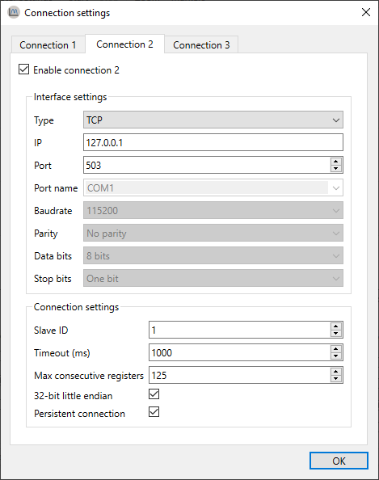

# Configuration

## Configure register settings

When you first open *ModbusScope*, no Modbus registers are added. To add registers, click on "Register Settings" in the toolbar on the interface. This will open a window where you can add and edit the registers that you want to monitor.

### Add Modbus registers

In the "Register settings" dialog, you can add Modbus registers either manually or by importing them from a *.mbc* file. When you open a *.mbs* file in *ModbusScope*, some registers may already be present in the dialog, which allows you to continue working with the previously used registers.

Once the registers have been added, you can adjust them as needed. This includes updating the name and changing the color. Expressions are used to define which data is added to the graph (and log).

> **NOTE**: The number of registers that are polled can greatly impact the sample rate. To achieve a higher resolution in time, you can either reduce the number of actively polled registers or make sure that the registers are in consecutive addresses so that they can be polled in one packet. This will help to increase the sample rate and improve the resolution of the data.

#### Registers

In *ModbusScope*, a Modbus register is represented as `${REG[@CONN][:TYPE]}` where `REG` is the register address, `CONN` is the connection number, and `TYPE` is the type of the register.

* `${45332}` => 16-bit unsigned using connection 1
* `${45332: s16b}` => 16-bit signed using connection 1
* `${45332@2: 32b}` => 32-bit unsigned using connection 2
* `${45332@2}` => 16-bit unsigned using connection 2

##### Register address

The Modbus standard defines the range for the holding register as 40001 to 49999. However, in the data packets that are sent, the offset of 40001 is removed. As the address field is 16-bit, the actual possible range is 40001 to 105536. To support as many devices as possible, *ModbusScope* supports the full range of addresses.

##### Supported register types

Following register types are currently supported by ModbusScope:

* `16b`: Unsigned 16-bit value

* `s16b`: Signed 16-bit

* `32b`: Unsigned 32-bit value

* `s32b`: Signed 32-bit value

* `f32b`: 32-bit float (IEEE 754)

The endianness of 32-bit registers can be configured per connection with the `32-bit little endian` setting in the connection settings dialog.

### Expressions

Expressions are used to define calculations or transformations of data in *ModbusScope*. They can be used to convert raw data from a Modbus register into a more meaningful value, or to perform mathematical operations on multiple registers. These expressions can be defined using a variety of mathematical operators and functions, as well as references to specific registers. For example, you could use an expression to calculate the power usage of a system by multiplying the voltage and current readings from two different registers.

*ModbusScope* supports a variety of binary operators that are commonly used in expressions such as `|` for bitwise OR, `&` for bitwise AND, `<<` for bitwise left shift, and `>>` for bitwise right shift. It also supports basic arithmetic operators like `+`, `-`, `*`, `/`, `%`, and `^` for addition, subtraction, multiplication, division, modulus and exponentiation respectively. In addition to the above operators, *ModbusScope* also supports hexadecimal numbers represented with the `0x` prefix and binary numbers represented with `0b` prefix. It also supports floating-point numbers, and both a decimal point and comma can be used as floating-point separator, whichever is encountered first. This allows for a greater flexibility in creating expressions that suit the user's needs.

Some examples of valid expressions are

* `${40001: s16b} + ${40002@2} * 2`
* `${40001: s32b} * 1.1`
* `${40001} + 0x1000`
* `${40001} & 0b11111000`
* `()${40001} >> 8) & 0xFF`

### Compose expression window

The compose expression window is a feature in *ModbusScope* that allows the user to create custom calculations using registers and other mathematical operations. Expressions allow for more flexibility in defining the data that is logged and displayed on the graph, and it can be used to create expressions that are specific to the user's needs. The compose expression window can be accessed from the register settings dialog, and it provides a user-friendly interface for creating and editing expressions.

This window can be opened by double-clicking the expression cell in the register settings dialog. This allows you to easily test and verify that the expression is functioning correctly before applying it to the logged data. The expression can be updated freely, and the register definition will be validated while you are entering it. When the register definition is green, it means that it is valid. The "example input" table can be used to enter values to test and verify the expression with actual values. This allows you to ensure that the expression is working as intended and to make any necessary adjustments before using it to log data. It is possible to combine multiple register reads in one expression by using mathematical operators and functions.

#### Expression error

When an error is detected in the expression or when the combination of the expression with a specific input value generates an error, no output value will be shown in the "compose expression" window. A specific error message will be displayed to indicate the issue, and the register definition will be highlighted in red, this allows the user to easily identify and correct any errors in the expression. It's important to test the expression before using it log data, to ensure that it is working correctly and producing the desired results.

## Configure connection settings

The "connection settings" window allows you to configure up to three connections, which means that several Modbus slaves can be polled in a single log session. Each connection can be configured with the Modbus protocol of the slave. ModbusScope support Modbus TCP and RTU. Modbus ASCII isn't supported.

Some settings such as IP, port, port name, baud rate, parity and number of data and stop bits are specific to the type of connection (TCP or RTU) and are used to establish a connection to the slave device. The other settings such as slave ID, timeout, max consecutive register, and 32-bit little endian, are specific to the Modbus protocol implementation in the device and are used to configure how the application communicates with the slave device.

The timeout settings determine how long the application will wait for a response from the slave before timing out. It is possible to read multiple consecutive registers in a single request in Modbus. However, most devices have a limit on the number of consecutive registers that can be read in a single request. This limit is referred to as the "maximum consecutive registers". In Modbus, 32-bit values are stored in two consecutive 16-bit registers, in either big-endian or little-endian format. In some devices, 32-bit values are stored in big-endian format by default, while in others they are stored in little-endian format. The 32-bit endianness setting in *ModbusScope* allows you to configure the endianness of the 32-bit values read from the registers, so that the application can correctly interpret the data. The persistent connection option is specific to *ModbusScope*. When enabled, it allows the application to keep the connection open between polling data points, which can increase the polling rate and reduce the time required to establish new connections. The connection will only be reinitialized when a connection error occurs. It's important to ensure that the connection settings are correct and that the correct protocol is selected before starting a log session. With correct configuration, the application will be able to communicate with the slave device and retrieve data from the registers.

In the "register settings" window, you can link each register to a specific connection. This allows you to poll multiple slaves simultaneously and display the data in a single graph for easy comparison.

## Configure log settings

*ModbusScope* creates a data file in the general temporary folder by default when a logging session is started. The data points are appended to the file during the logging session, so that the data can be recovered in case of an unforeseen crash or if the user forgets to save the data before quitting the application. The temporary file is cleared every time a polling session is started, so that new data can be logged.

Some of the behavior can be customized in the *log settings* window. The user can choose to disable the feature or change the location of the temporary data file. This allows the user to ensure that the data is saved in a location that is convenient for them.

*ModbusScope* will create a data file in the general temporary folder when a logging session is started by default. *ModbusScope* will append data points during the logging to this file. When the user forgets to save the data before quitting or when an unforeseen crash occurs, the data can be recovered. The temporary file is cleared every time a polling session is started. In the *log settings* window, this behavior can be disabled or the temporary data file can be changed.

By default, *ModbusScope* will log data points every 250 milliseconds. This is the default sample rate and it can be adjusted in the *log settings* window. The user can increase or decrease the sample rate to suit their needs. Additionally, by default, *ModbusScope* will log timestamps relative to the start of the log session. This means that the time-stamp of each data point is recorded as the time elapsed since the start of the logging session. However, this behavior can be changed by enabling the *use absolute times* option in the *log settings* window. When this option is enabled, absolute timestamps are logged instead, meaning that the actual date and time of each data point is recorded in the log file.

This feature allows the user to choose the time-stamp format that is most appropriate for their use case and to easily compare the logged data with other data that may have been collected at different times.

### Optimize logging interval

The minimum logging interval is determined by several factors such as the Modbus protocol and the register addresses. When the requested register addresses aren't in successive order, the Modbus protocol has an inherent slowdown and *ModbusScope* will split the read request into several packets. This will negatively impact the minimum logging interval because of the Modbus end of frame timeout. To achieve a fast logging interval, it's important to limit the number of registers and make sure that consecutive registers are polled. This can help minimize the inherent slowdown caused by the Modbus protocol and allow for a faster logging interval.