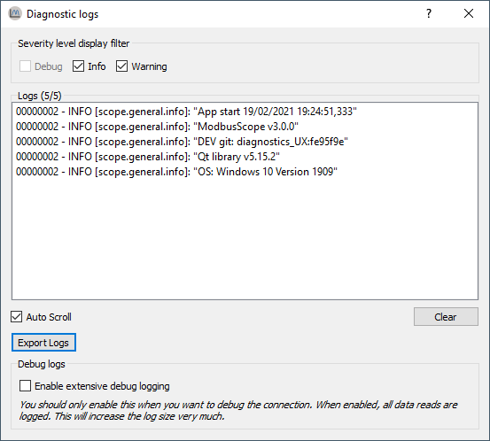

# Diagnostics

## Diagnostic logging

During a logging session, various errors may occur. To facilitate quick examination and resolution of these errors, *ModbusScope* has built-in logging capabilities. For example, if a slave responds too slowly, a timeout may be generated. All register reads are recorded in the diagnostic logs along with the results, allowing communication or connection errors to be easily examined. Other common errors include Modbus exceptions, such as when a register configuration is incorrect. 

The log will also include basic information about *ModbusScope* and the system it is running on, such as the operating system and its specific version.

## Logs window

Opening the *diagnostic logs* windows can be done with *Help > Diagnostic logs...*

The logs can be viewed in the logs window. The log list will dynamically update as new logs are added. By using the filters, specific categories of logs can be hidden or shown. Specific logs can be selected and copied to the clipboard by right-clicking on them. Alternatively, all logs can be exported using the "Export Logs" button. Additionally, extensive debug logging can be enabled to log extra (internal) information about the status of every read. However, this option will dramatically increase the number of logs generated.
