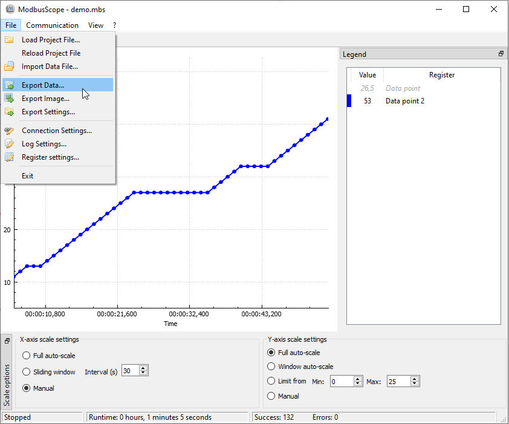
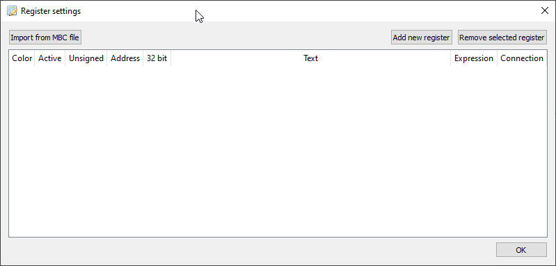
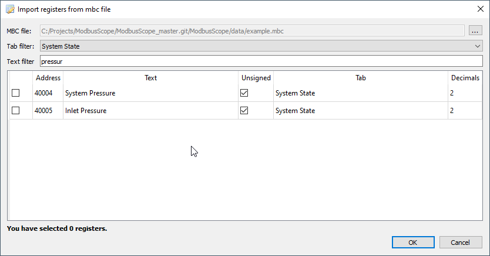
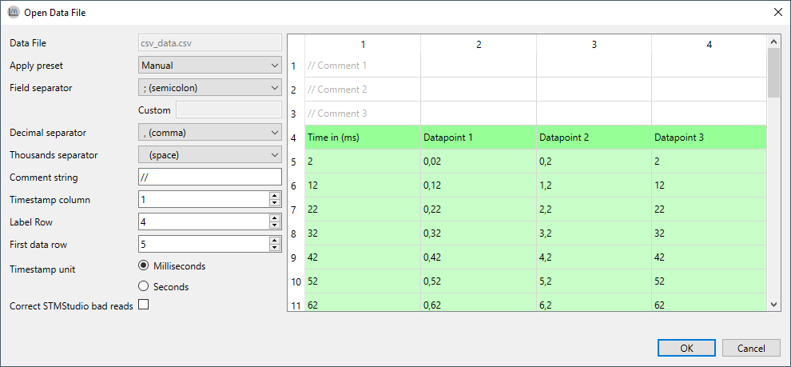

# Importing and exporting

## Storing and reusing configuration

Typically the same set of registers is needed. The configuration of registers as described in the previous section can be stored and reloaded through an *.mbs* file. Storing the settings as *.mbs* file can be done through the *File > Export Settings...* and reloading them from the *.mbs* file can be done through *File > Load Project File...* or by dragging an *.mbs* file into the application.

## Exporting data/image

To store any results these can be exported either as image or as data (*.csv* ) file. This can be selected with either *File > Export Data...* or  *File > Export Image...* . Exporting data/image or settings is only possible when logging isn't active.

## Import register definitions from mbc file

The *.mbc* file is provided and used for the registers in *ModbusControl*.  Since this is the easiest way, click on *Import from .mbc file*. You can also open this window by dragging and dropping the *.mbc* file in the main screen of *ModbusScope*.

By pressing the *...* button in the top right corner the path to an *.mbc* can be given. By using either the *Text filter* or scrolling through the list, find and mark each register for which the value must be added to the graph. If all registers that you want to inspect are selected, press *OK*.

## Import CSV file

One other functionality of *ModbusScope* is parsing *.csv* files which are in a similar format of the *ModbusScope* export files. This means a timestamps column followed by one or more data columns.

Opening a data file can be done through *File > Open Data File...* or by dragging an *.csv* file into the application. ModbusScope will load an excerpt of the data file to try to automatically determine the configuration required for parsing. The most important settings are the used field and decimal separators. When the auto parsing of settings is done, the settings can be manually changed if required. The result of the parsing of immediately visualized in the table view.

When all settings are configured and accepted, *ModbusScope* will load the rest of the file with the configured settings. When the loading has finished successfully, the graph can be examined in the same way as normal *ModbusScope* logs.

