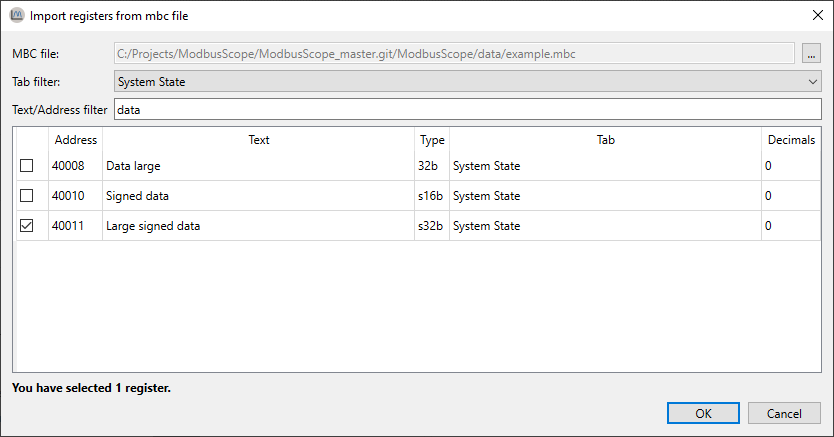

# Importing and exporting

## Storing and reusing configuration

The configuration of registers as described in the previous section can be stored and reloaded in a project file. Storing the settings in a *.mbs* file can be done through the *File > Save Project As...* and reloading them can be done through *File > Open Project ...* or by dragging a *.mbs* file into the application.

## Exporting data/image

Current log results can be exported either as image or as data (*.csv*) file. This can be selected with either *File > Save Data File As...* or  *File > Export Image As...* . Saving a project/data file or exporting an image is only possible when logging isn't active.

## Open data file

Opening a data file is described in detail in a separate chapter of the user manual.

## Import register definitions from *mbc* file

*ModbusControl* is an application to read/write registers from Modbus slaves. The *ModbusControl* project file (*.mbc*) can be used to add registers definitions to *ModbusScope*. The easiest way is to click on *Import from .mbc file* in the register dialog. You can also open this window by dragging and dropping the *.mbc* file in the main screen of *ModbusScope*.

By pressing the *...* button in the top right corner the path to an *.mbc* can be given. By using either the *Text filter* or scrolling through the list, find and mark each register for which the value must be added to the graph.
