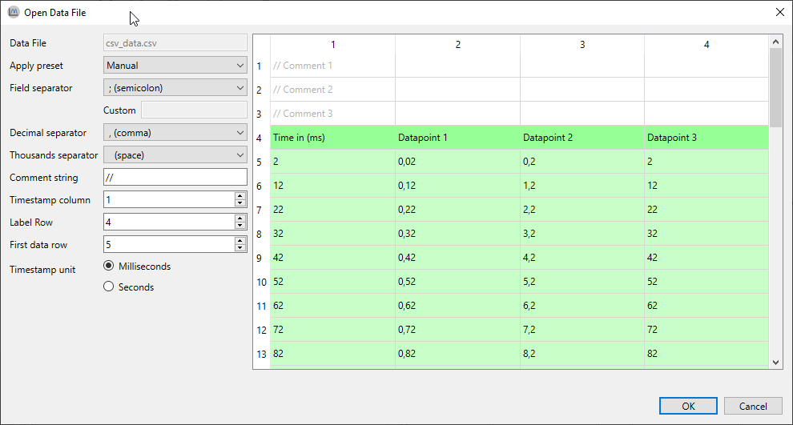

# Open data file

When a data file, saved by *ModbusScope*, is opened by selecting *File > Open Data File...*, the data file will be automatically parsed and all data will be loaded. Opening a data file can be done through *File > Open Data File...* or by dragging an *.csv* file into the application.

When the file format isn't compatible with a *ModbusScope* export, it will load an excerpt of the data file to try to automatically determine the configuration required for parsing the files. The most important settings are the field and decimal separators. When the auto parsing of settings is done, the settings can be manually changed if required. The result of the parsing is immediately visualized in the table view.

When all settings are configured and accepted, *ModbusScope* will load the rest of the file with the configured settings. When the loading has finished successfully, the graph can be examined in the same way as normal *ModbusScope* logs.



## Parse settings

There isn't a standard for the format of a *.csv* file. Parsing a data file is only possible when all settings are correct for that specific data file. There are several categories of settings. The settings can be changed and the grid will be updated with the parsing results.

### Locale related

Depending on the configured region, the format of the data will will be different. To provide maximum flexibility when opening a data file, *ModbusScope* allows to freely select these settings.

* Field separator
  * A symbol used to separate data fields from each other.

* Decimal separator
  * A symbol used to separate the integer part from the fractional part of a number written in decimal form (e.g., "." in 12.45).

* Thousand separator
  * A symbol used to create a division between groups of digits. In this case

### File structure related

*ModbusScope* can only parse *.csv* files which are in a similar format of the *ModbusScope* export files. This means a timestamps column followed by one or more data columns.

#### Supported data file format

```
Time (ms);Datapoint 1;Datapoint 2;Datapoint 3
2;0,02;0,2;2
12;0,12;1,2;12
22;0,22;2,2;22
32;0,32;3,2;32
```

#### Settings

Since there is no standard for the contents of *.csv* file, some settings needs to filled in to be able to correctly parse time data.

* Comment String
  * Symbol(s) in the beginning of a line that indicate(s) that a line should be ignored when parsing.
  * Shouldn't be longer than 2 characters.

* Time stamp column
  * Sometimes the time data isn't in the first column. This setting can be used to select to correct column.
  * All columns to the right of the time data column will be parsed for data

* Label row
  * This setting indicates the row with the labels (names) for the graphs.
  * Can be used to skip header lines in the file.
  * The label row should contains the same number of fields as the data rows

* Data row
  * Similar to the the label row, but for the data

### Functionality

*ModbusScope* adds some extra functionality when opening a data file. The *time-stamp unit* can be selected between milliseconds and seconds. When seconds is selected, the time-stamp will be converted to milliseconds during the load process.

#### Correct STMStudio bad read

This feature is only used for a very specific use case when loading a data file created with STMStudio. The STMStudio tool reads data directly from the RAM memory of a embedded devices. The main drawback is that reading a 16 bit variable can sometimes return a corrupt value on a 8 bit microcontroller. A single byte (most or least significant) of the 16 bit value will be reset to zero's or set to one's.

*ModbusScope* is able to detect most of these corrupt values and correct them based on previous and next value in the graph.

**This feature will probably be deprecated and removed in a future release of *ModbusScope*.**

## Presets

When analyzing several data files of which the settings can't be auto-detected, it is handy to save the settings as a preset. *ModbusScope* allows to create a configuration file with custom presets. This configuration file will be loaded when opening a datafile and the correct preset can be selected. It is also possible to configure a keyword per preset. When a data file name contains the keyword, the preset will be automatically selected.

### Locations

*ModbusScope* searches for the `presets.xml` configuration file in 2 specific locations. The first location is the documents folder of the current Windows user: `C:/Users/<USER>/Documents/`. The preset configuration file should be in a subfolder named `ModbusScope`. When the preset configuration file isn't found, *ModbusScope* will try to find the file in the same location as the main executable of *ModbusScope*. When the file isn't found in both location, *ModbusScope* will use the built-in presets. When a valid preset configuration file has been found, the built-in presets will be replaced will the preset mentioned in this file.

### Keyword

As mentioned before, a preset can be automatically selected based on the presence of a keyword in the name of the data file.

### Example preset configuration file

```xml
<modbusscope>
	<parsepreset>
		<name>Default (be)</name>
		<keyword>-be</keyword>
		<fieldseparator><![CDATA[;]]></fieldseparator>
		<decimalseparator><![CDATA[,]]></decimalseparator>
		<thousandseparator><![CDATA[ ]]></thousandseparator>
		<commentSequence><![CDATA[//]]></commentSequence>
		<column>1</column>
		<labelrow>1</labelrow>
		<datarow>2</datarow>
	</parsepreset>
	
	<parsepreset>
		<name>be-seconds</name>
		<fieldseparator><![CDATA[;]]></fieldseparator>
		<decimalseparator><![CDATA[,]]></decimalseparator>
		<thousandseparator><![CDATA[ ]]></thousandseparator>
		<commentSequence><![CDATA[//]]></commentSequence>
		<column>1</column>
		<labelrow>1</labelrow>
		<datarow>2</datarow>
		<timeinmilliseconds>false</timeinmilliseconds>
	</parsepreset>

</modbusscope>
```

