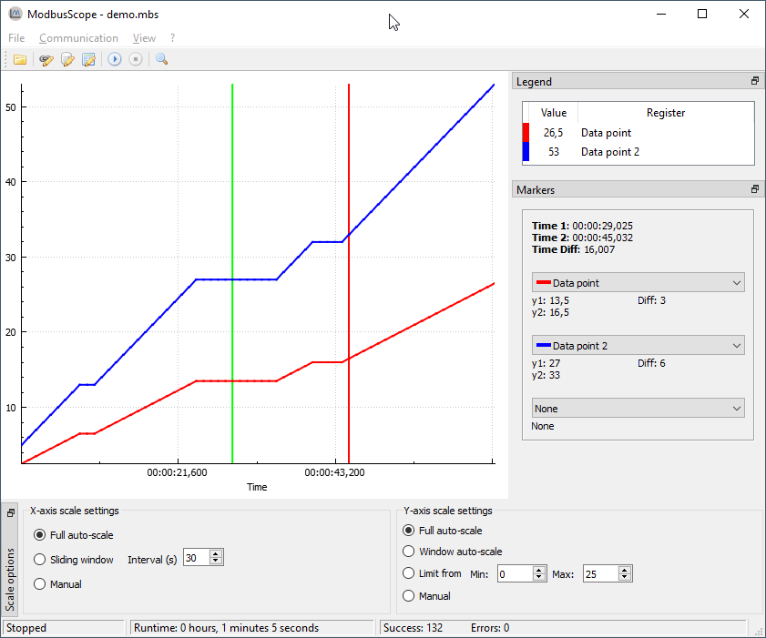

# Overview

This user manual describes how to get started with *ModbusScope*. *ModbusScope* is an application which can sample Modbus registers and plot the value in a graph to visualize and investigate the dynamic behavior of a system.

## Main screen

The main screen of ModbusScope can contain multiple docked windows. Most are visible at the initial start of the application, except the marker window. This docked windows only appears when a marker has been enabled.

The most important part of the window is the plot view. The data of the active registers that are polled is shown here as plots. The settings in the axis scale windows can be used to visualize a very specific part of the data or auto scale to show all information. The legend shows an overview of the active registers. You can hide a specific register plot by double clicking it in the legend. The same action can be used to show the plot again. When a plot is hidden the register is still polled, it is only temporary hidden in the plot view. Markers can be used examine the data in a specific time frame. 

## Installing

*ModbusScope* can be installed with the provided *.msi* installer. Double-click it and follow the instructions. The installer will install the required files on your computer. At the end of the install process, you can also select to open *.mbs* files with *ModbusScope* by default.

## Quick start

A quick start to use *ModbusScope*:

* Add a register using the register settings window
* Configure connection settings to match your Modbus TCP slave
* Press the *Start Logging* button (play) to start logging
* Press the *Stop Logging* button to stop logging
* Examine logged data
