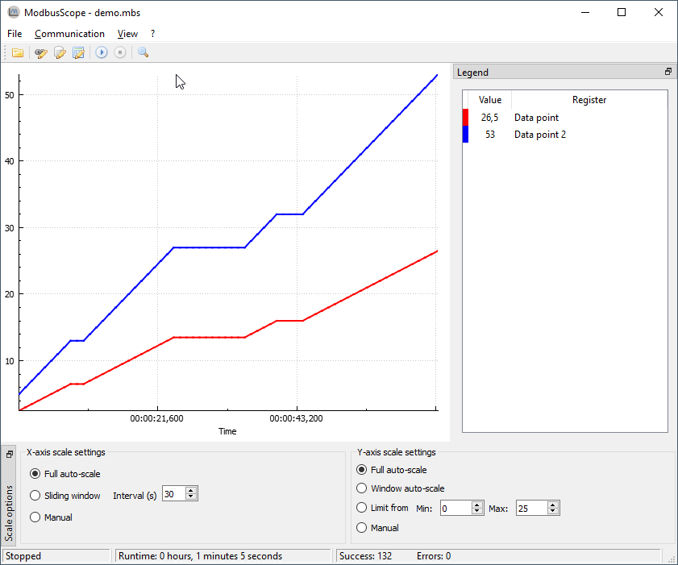

# Overview

This guide explains the basics of using ModbusScope. The software is designed to collect and display data from Modbus registers in a graphical format, making it easy to monitor and analyze the dynamic behavior of a system.

## Installing

The *ModbusScope* installer or standalone version can always be downloaded from the [release page](https://github.com/jgeudens/ModbusScope/releases).

ModbusScope can be easily installed by double-clicking on the provided `.msi` installer file and following the on-screen instructions. The installer will handle the installation of all necessary files on your computer. At the end of the install process, you have the option to set ModbusScope as the default application for opening `.mbs` files.

## Main screen

When you first open ModbusScope, you'll see several windows displayed on the main screen. Some of them, like the marker window, may not be visible immediately. This window will only appear when a marker has been enabled within the application.

The plot view is the central part of the *ModbusScope* window. It displays the data of the active registers that are being polled, represented as plots. The settings in the axis scale dock allow you to zoom a specific parts of the data or automatically scale the view to show all of the information. The legend provides an overview of the active registers and you can hide or show a specific register plot by double-clicking it in the legend. When a plot is hidden, the register is still being polled, it is only temporarily hidden in the plot view. Additionally, markers can be used to examine the data within a specific time frame, which allows for more detailed analysis.

## Quick start

To get started with *ModbusScope*:

- Use the register settings window to add the desired Modbus registers
- Adjust the connection settings according to your connection the Modbus slave.
- Press the *Start Logging* button (play icon) to begin collecting data.
- Press the *Stop Logging* button to stop logging.
- Examine the logged data using the various windows and tools provided by the application.