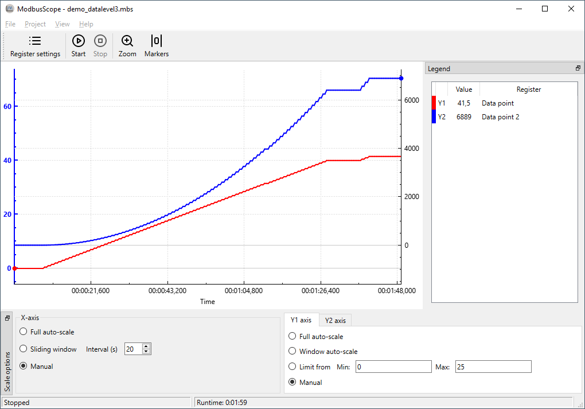

# Overview

## Installing

The *ModbusScope* installer or standalone version can always be downloaded from the [release page](https://github.com/ModbusScope/ModbusScope/releases).

ModbusScope can be easily installed by double-clicking on the provided `.msi` installer file and following the on-screen instructions. The installer will handle the installation of all necessary files on your computer. At the end of the install process, you have the option to set ModbusScope as the default application for opening `.mbs` files.

## Getting started

### Open ModbusScope

### Configuring Modbus Connection

1. Open the configuration settings.
2. Enter the details of your connection to the Modbus device, such as IP address and port.
3. Save the configuration.

### Configure Modbus registers

1. Use the register settings window to add the desired Modbus registers
   1. Change name, colors, type, ...
   2. Optionally perform some calculation on the register.

### Logging Data

1. Click on the "Start Logging" button.
2. Visualize the data in real-time using the provided tools
   1. Adjust the time or value axis scale

### Exporting Data

1. After logging data, click on the "Export" button.
2. Choose the file location and export the data as a CSV file for further analysis.