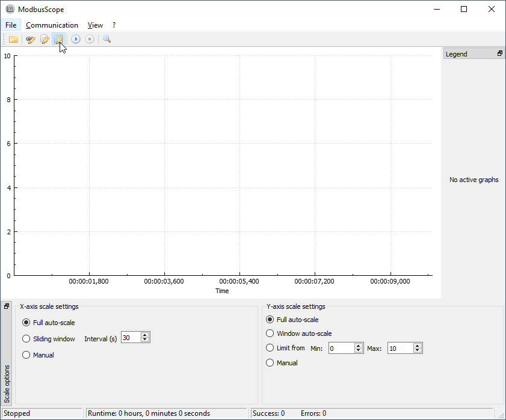
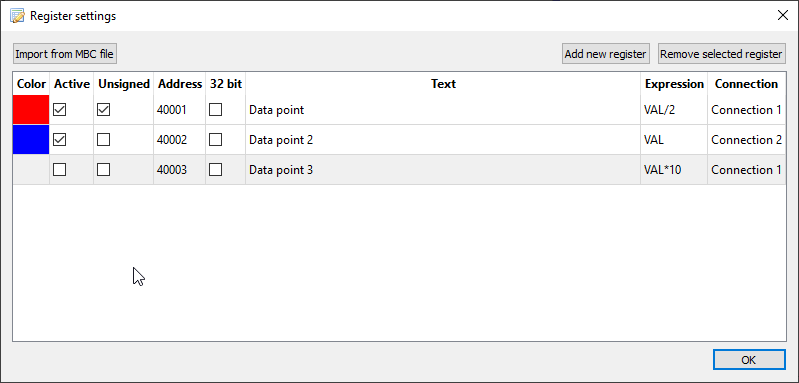
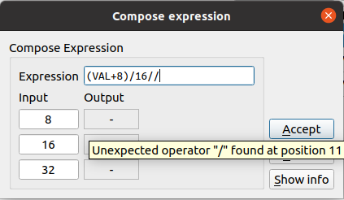
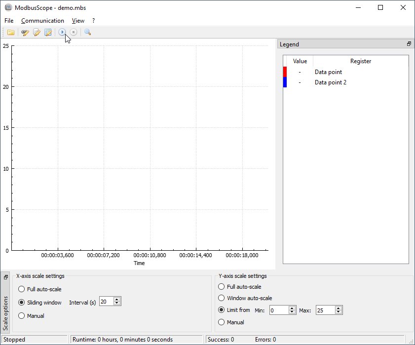
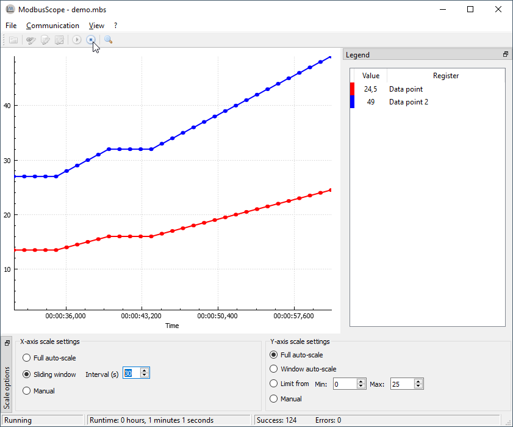

# ModbusScope - User Manual

This user manual describes how to get started with *ModbusScope*. *ModbusScope* is a program which can sample Modbus registers and plot the value in a graph to visualize and investigate the dynamic behavior of a system.

[TOC]

## Installing

*ModbusScope* can be installed with the provided *.msi* installer. Double-click it and follow the instructions. The installer will install the required files on your computer. At the end of the install process, you can also select to open *.mbs* files with *ModbusScope* by default.

## Register settings

When opening *ModbusScope*, no Modbus registers are added. First click on *Register Settings* in the tool bar of  the interface. This will open a window where registers can be added and adjusted.

### Configure Modbus registers

In the below dialog Modbus registers can be added either manually or by importing from a *.mbc* file. When a *.mbs* file is loaded, registers will already be present in the dialog.

When the registers are added, they can be adjusted. Such as updating the name and changing to a specific color. An expression can be used to update the value before the data is added to the graph (and log). This calculations can be used to transform the values from a device to a format that is more clear for the user. It is also possible to select a specific connection on which the value is polled. 

> **NOTE**: The number of registers that are polled significantly impacts the sample rate. For higher resolution in time, reduce the number of registers that are actively polled or make sure the register are in subsequent addresses so they can be polled in one packet.

### Compose expression window

As mentioned before, an expression can be used to transform the raw value from the device to something more understandable by the user. This expression can be tested in the *compose expression* window. This windows can be opened by double clicking the expression cell.

The expression can be freely updated and up to 3 input values can be evaluated.

#### Expressions

The value read via Modbus is represented as `VAL`. The most common binary operators are supported (`!`, `|`, `&`, `<<`, `>>`). The basic arithmetic operators are also supported (`+`,` -`, `*`, `/`, `%`, `^`). Hexadecimal numbers can be represented with the `0x` prefix. Binary are represented with `0b` prefix. Floating point number are also supported. Both a decimal point as comma can be used. The first encountered characters per expression is used as floating point separator.

Some examples:

* `(VAL + 10 / 2) / 10`

* `(VAL & 0xFF) | 1`
* `0xFF & 0b1111`

* `VAL * 0.001`

#### Expression error

When the expression contains an error or when the combination of the expression with a specific input value generates an error, no output value is shown and a specific error message can be visualized by hovering over the output field.

## Storing and reusing configuration

Typically the same set of registers are needed. The configuration of registers as described in the previous section can be stored and reloaded through an *.mbs* file. Storing the settings as *.mbs* file can be done through the *File > Export Settings...* and reloading them from the *.mbs* file can be done through *File > Load Project File...* 

## Logging values

Once some registers are added, the actual logging can be done. *ModbusScope* tries to communicate through the active *ModbusControl* instance. Make sure *ModbusControl* is set-up and working correctly.

Then press the *Start Logging* button. *ModbusScope* will start logging and automatically add the values to the graph.

> **NOTE**: When restarting the logging using the *Start Logging* button any data already present in the graph will be cleared.

Once your test is finished the logging can be stopped by pressing the *Stop Logging* button. The logging will stop and the values can be inspected.

## Exporting data/image

To store any results these can be exported either as image or as data (*.csv* ) file. This can be selected with either *File > Export Data...* or  *File > Export Image...* .

## Using markers

*ModbusScope* can help in investigating dynamic behavior of a system by measuring times and value differences between two points in the graph. First two vertical markers have to be added.

Add the left marker (green vertical line) by pressing *<Ctrl>* and *<Left mouse click>* on the place of interest. The position must coincide with a sample in the graph. Add the right marker (red vertical line) by pressing *<Ctrl>* and *<Right mouse click>* on the place of interest. 

On the right hand side the *Markers* panel will show information about the markers. Such as the value of the registers at *Time 1* (left hand marker) and *Time 2* (right hand marker). Also the time difference between the two markers or value difference between the two marked times.

## Import register definitions from mbc file

The *.mbc* file is provided and used for the registers in *ModbusControl*.  Since this is the easiest way, click on *Import from .mbc file*. You can also open this window by dragging and dropping the *.mbc* file in the main screen of *ModbusScope*.

By pressing the *...* button in the top right corner the path to an *.mbc* can be given. By using either the *Text filter* or scrolling through the list, find and mark each register for which the value must be added to the graph. If all registers that you want to inspect are selected, press *OK*.

