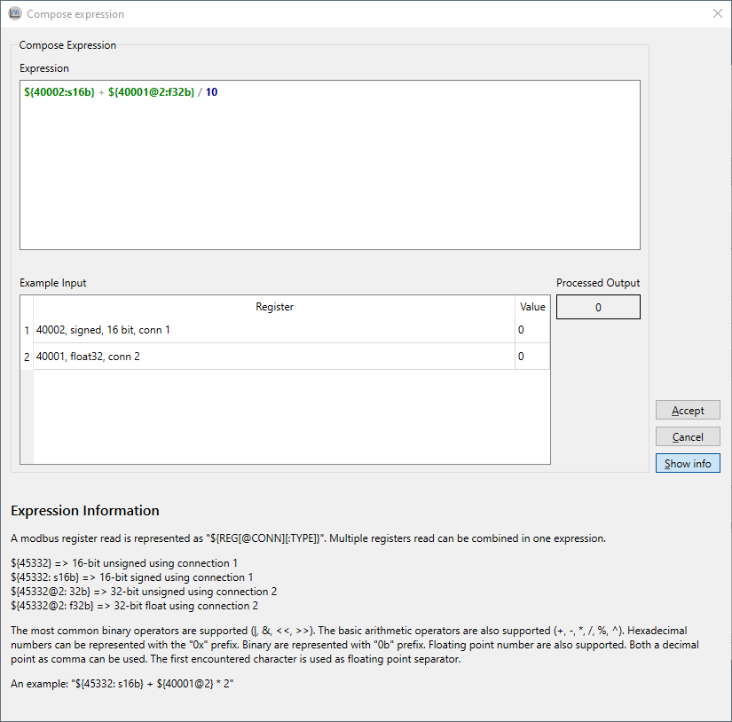

# ModbusScope - User Manual

This user manual describes how to get started with *ModbusScope*. *ModbusScope* is an application which can sample Modbus registers and plot the value in a graph to visualize and investigate the dynamic behavior of a system.

## Overview

The main screen of ModbusScope can contain multiple docked windows. Most are visible at the initial start of the application, except the marker window. This docked windows only appears when a marker has been enabled.

The most important part of the window is the plot view. The data of the active registers that are polled is shown here as plots. The settings in the axis scale windows can be used to visualize a very specific part of the data or auto scale to show all information. The legend shows an overview of the active registers. You can hide a specific register plot by double clicking it in the legend. The same action can be used to show the plot again. When a plot is hidden the register is still polled, it is only temporary hidden in the plot view. Markers can be used examine the data in a specific time frame. 

## Installing

*ModbusScope* can be installed with the provided *.msi* installer. Double-click it and follow the instructions. The installer will install the required files on your computer. At the end of the install process, you can also select to open *.mbs* files with *ModbusScope* by default.

## Register settings

When opening *ModbusScope*, no Modbus registers are added. First click on *Register Settings* in the tool bar of  the interface. This will open a window where registers can be added and adjusted.

## Register settings

When opening *ModbusScope*, no Modbus registers are added. First click on *Register Settings* in the tool bar of  the interface. This will open a window where registers can be added and adjusted.

### Configure Modbus registers

In the below dialog Modbus registers can be added either manually or by importing from a *.mbc* file. When a *.mbs* file is loaded, registers will already be present in the dialog.

When the registers are added, they can be adjusted. Such as updating the name and changing to a specific color. An expression can be used to update the value before the data is added to the graph (and log). This calculations can be used to transform the values from a device to a format that is more clear for the user. It is also possible to select a specific connection on which the value is polled. 

> **NOTE**: The number of registers that are polled significantly impacts the sample rate. For higher resolution in time, reduce the number of registers that are actively polled or make sure the register are in subsequent addresses so they can be polled in one packet.

### Compose expression window

As mentioned before, an expression can be used to transform the raw value from the device to something more understandable by the user. This expression can be tested in the *compose expression* window. This windows can be opened by double clicking the expression cell.

The expression can be freely updated and up to 3 input values can be evaluated.

#### Expressions

The value read via Modbus is represented as `VAL`. The most common binary operators are supported (`!`, `|`, `&`, `<<`, `>>`). The basic arithmetic operators are also supported (`+`,` -`, `*`, `/`, `%` and `^`). Hexadecimal numbers can be represented with the `0x` prefix. Binary are represented with `0b` prefix. Floating point numbers are also supported. Both a decimal point as comma can be used. The first encountered characters per expression is used as floating point separator.

Some examples:

* `(VAL + 10 / 2) / 10`

* `(VAL & 0xFF) | 1`
* `0xFF & 0b1111`

* `VAL * 0.001`

#### Expression error

When the expression contains an error or when the combination of the expression with a specific input value generates an error, no output value is shown and a specific error message can be visualized by hovering over the output field.

## Storing and reusing configuration

Typically the same set of registers is needed. The configuration of registers as described in the previous section can be stored and reloaded through an *.mbs* file. Storing the settings as *.mbs* file can be done through the *File > Export Settings...* and reloading them from the *.mbs* file can be done through *File > Load Project File...* or by dragging an *.mbs* file into the application.

## Graph view

#### Start/stop log

Once some registers are added, the actual logging can be started. *ModbusScope* will communicate with the Modbus TCP slave defined in the connection settings. This slave can also be a Modbus TCP to Modbus RTU bridge like *ModbusControl*. Make sure Modbuscontrol is active and communication to the Modbus RTU slave is working correctly.

Then press the *Start Logging* button. *ModbusScope* will start logging and will automatically add the values to the graph.

> **NOTE**: When restarting the logging using the *Start Logging* button any data already present in the graph will be cleared.

Once your test is finished the logging can be stopped by pressing the *Stop Logging* button. The logging will stop and the values can be inspected further.

### Scale settings

While ModbusScope is logging, the already logged values can be inspected in the graph view. With the different scale settings, the data can be examined while new values are still be being added to the log. Several scale settings are available.

#### X-axis

There are 3 options for the scaling of the x-axis: *full auto-scale*, *sliding window* and *manual* settings. When *full auto-scale* is selected, the x-axis will automatically scale the maximum of the x-axis to keep all time values in the graph. In the *sliding window* setting only the values of a specific last time span will be visible. This time span is configurable. *Manual* scale setting means that the scaling isn't changed automatically while logging. Even when new values are logged, the current time period stays the same.

#### Y-axis

Compared to the x-axis setting, the y-axis shares 2 settings: *full auto-scale* and *manual*. These settings are the same as with the x-axis. The 2 other modes are *window auto-scale* and the *limit from* setting. The *window auto-scale* automatically scales the y-axis based on the values that are currently visible. The *limit from* setting allows the user to configure the minimum and maximum values of the axis.

### Zoom

The graph view supports zooming to examine the log in detail. When the scroll wheel of the mouse is used, both axis switch to manual setting and the range of the axis is increased or decreased based on the scroll wheel. The current position of the mouse cursor is used as reference point for the zoom action.

It is possible to select a single axis to only zoom this axis by clicking it. The range of the other axis will remain the same when zooming (mouse wheel scroll). An axis can be unselected by clicking somewhere in the graph view. An axis can be reset to full auto-scale setting by double clicking it.

### Markers

*ModbusScope* can help in investigating dynamic behavior of a system by measuring times and value differences between two points in the graph. First two vertical markers have to be added.

Add the left marker (green vertical line) by pressing *<Ctrl>* and *<Left mouse click>* on the place of interest. The position must coincide with a sample in the graph. Add the right marker (red vertical line) by pressing *<Ctrl>* and *<Right mouse click>* on the place of interest. 

On the right hand side the *Markers* panel will show information about the markers. Such as the value of the registers at *Time 1* (left hand marker) and *Time 2* (right hand marker). Also the time difference between the two markers or value difference between the two marked times.

## Configuration

### Connection settings

A Modbus TCP connection needs to configured correctly before any data can be read. In the *connection setting* window, up to 2 connections can be configured. A register can be coupled to a specific connection in the *register settings* window.

Most settings (*IP*, *port*, *slave ID* and *timeout*) are general Modbus protocol settings. The other settings (*max consecutive register* and *32-bit little endian*) are specific to the Modbus protocol implementation in the device. The *persistent connection* option is specific to *ModbusScope*. When enabled, *ModbusScope* will keep the connection open between polling data points. The connection will only be reinitialized when a connection error occurs.

### Log settings

*ModbusScope* will create a data file in the OS temporary folder when a logging session is started by default. *ModbusScope* will append data points during the logging to this file. When the user forgets to save the data before quitting or when an unforeseen crash occurs, the data can be recovered. The temporary file is cleared every time a polling session is started. In the *log settings* window, this behavior can be disabled or the temporary data file can be changed.

By default, *ModbusScope* will log data points every 250 milliseconds. This can be adjusted in this *log settings* windows. *ModbusScope* will log timestamps relative to the start of the log session by default. By enabling the *use absolute times* option, absolute timestamps are logged instead.

#### Optimize logging interval

The minimum logging interval is determined by several factors. The Modbus protocol has an inherent slowdown when register addresses aren't in successive order. When the register addresses aren't successive, *ModbusScope* will split the read request in several packets. But this will negatively impact the minimum logging interval because of the Modbus end of frame timeout. When a fast logging interval is required then limit the number of registers and make sure all register are in order.

## Exporting data/image

To store any results these can be exported either as image or as data (*.csv* ) file. This can be selected with either *File > Export Data...* or  *File > Export Image...* . Exporting data/image or settings is only possible when logging isn't active.

## Import register definitions from mbc file

The *.mbc* file is provided and used for the registers in *ModbusControl*.  Since this is the easiest way, click on *Import from .mbc file*. You can also open this window by dragging and dropping the *.mbc* file in the main screen of *ModbusScope*.

By pressing the *...* button in the top right corner the path to an *.mbc* can be given. By using either the *Text filter* or scrolling through the list, find and mark each register for which the value must be added to the graph. If all registers that you want to inspect are selected, press *OK*.

## Import CSV file

One other functionality of *ModbusScope* is parsing *.csv* files which are in a similar format of the *ModbusScope* export files. This means a timestamps column followed by one or more data columns.

A data file load can be done through *File > Load Data File...* or by dragging an *.csv* file into the application. ModbusScope will load an excerpt of the data file to try to automatically determine the configuration required for parsing. The most important settings are the used field and decimal separators. When the auto parsing of settings is done, the settings can be manually changed if required. The result of the parsing of immediately visualized in the table view.

When all settings are configured and accepted, *ModbusScope* will load the rest of the file with the configured settings. When the loading has finished successfully, the graph can be examined in the same way as normal *ModbusScope* logs.

