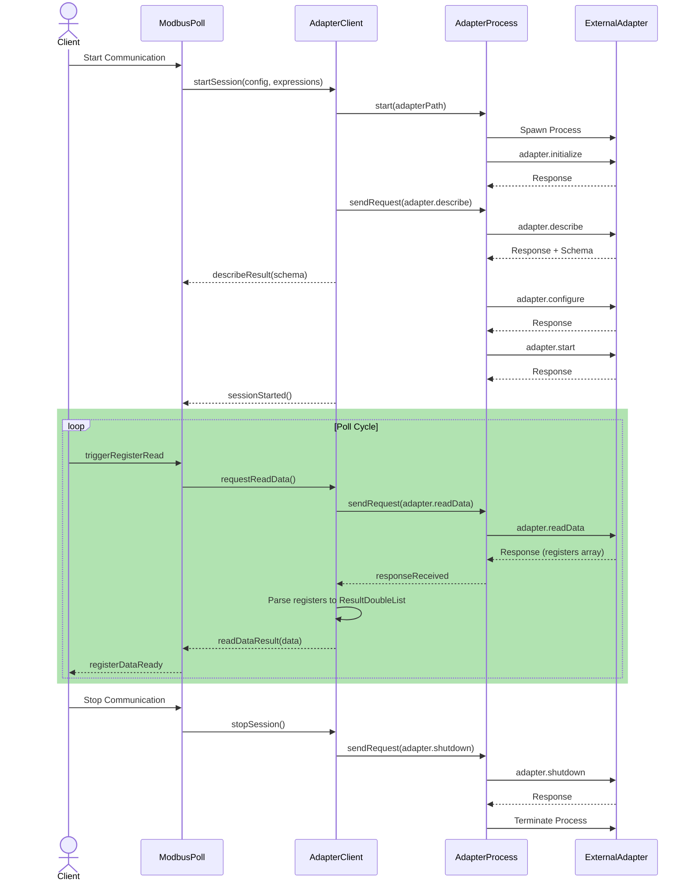

# Sequence diagram

## Sequence Diagram(s)

```mermaid
sequenceDiagram
    actor Client
    participant ModbusPoll
    participant AdapterClient
    participant AdapterProcess
    participant ExternalAdapter

    Client->>ModbusPoll: Start Communication
    ModbusPoll->>AdapterClient: startSession(config, expressions)
    AdapterClient->>AdapterProcess: start(adapterPath)
    AdapterProcess->>ExternalAdapter: Spawn Process

    AdapterProcess->>ExternalAdapter: adapter.initialize
    ExternalAdapter-->>AdapterProcess: Response

    AdapterClient->>AdapterProcess: sendRequest(adapter.describe)
    AdapterProcess->>ExternalAdapter: adapter.describe
    ExternalAdapter-->>AdapterProcess: Response + Schema
    AdapterClient-->>ModbusPoll: describeResult(schema)

    AdapterProcess->>ExternalAdapter: adapter.configure
    ExternalAdapter-->>AdapterProcess: Response

    AdapterProcess->>ExternalAdapter: adapter.start
    ExternalAdapter-->>AdapterProcess: Response
    AdapterClient-->>ModbusPoll: sessionStarted()

    rect rgba(100, 200, 100, 0.5)
    loop Poll Cycle
        Client->>ModbusPoll: triggerRegisterRead
        ModbusPoll->>AdapterClient: requestReadData()
        AdapterClient->>AdapterProcess: sendRequest(adapter.readData)
        AdapterProcess->>ExternalAdapter: adapter.readData
        ExternalAdapter-->>AdapterProcess: Response (registers array)
        AdapterProcess-->>AdapterClient: responseReceived
        AdapterClient->>AdapterClient: Parse registers to ResultDoubleList
        AdapterClient-->>ModbusPoll: readDataResult(data)
        ModbusPoll-->>Client: registerDataReady
    end
    end

    Client->>ModbusPoll: Stop Communication
    ModbusPoll->>AdapterClient: stopSession()
    AdapterClient->>AdapterProcess: sendRequest(adapter.shutdown)
    AdapterProcess->>ExternalAdapter: adapter.shutdown
    ExternalAdapter-->>AdapterProcess: Response
    AdapterProcess->>ExternalAdapter: Terminate Process
```

